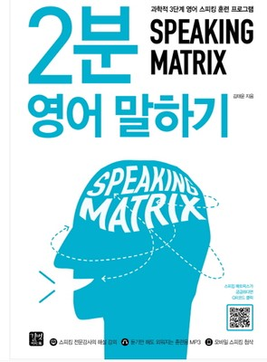

### TE (Today English)
- Today English 섹션의 목적은 영어 능력을 향상시키기 위함이다. 특히, 말하기 영역을 증대시키고 싶어서 시작한 프로젝트이지만, 현재 좀 더 확장시켜 문장을 통째로 외우기로 한다.

- 하루에 한 문장을 큰소리로 10번 이상 읽는 것을 목적으로 한다.
- 이전에 했던 즉, 외웠던 문장들을 상기시키며 떠오르는 문장들은 적고자 한다.
- 첫 번째 책은 2분말하기 책을 기준으로 한다. 모든 자료를 공개할 순 없고 외운 문장위주로 막 적어가며 포스팅 하도록 한다.
- 

