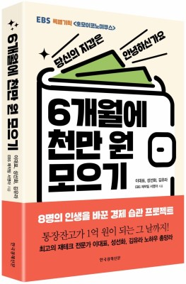

### 6개월에 천만원 모으기
- 이 책을 읽고 경제 관념에 대해 다시 생각해보게 되었다. 꼭 월급을 많이 받아야만 천만원을 모을 수 있을까? 에 대한 의문을 풀게 되었으며, 월급이 중요한게 아니라 절제의 습관만으로 천만원을 모을 수 있다는 것을 확인했다. 이 책에서 가장 기억에 남는 것은 4 가지 인것 같다. (더 많은 것들이 생각 날 수도 있지만.. 기록을 하지 않고 오로지 현재 기억에 의존해 쓰다보니 4 가지가 기억에 남는다.)

 1. 절약은 절제에 다른 이름이다.
    - 절약을 한다는 것은 내 욕구를 절제하는 것이다. 내가 하고 싶은 욕구를 제어한다는 것은 소비 뿐만아니라 인생을 살아가면서 중요한 것이라고 생각한다. 돈이라는 수단하나를 통제하지 못한다면 과연 나 자신을 통제할 수 있을까? 더 나아가 내가 하고싶은 일을 할 수 있을까? 하는 생각이 들었다. 어쩌면, 절제의 근육을 가장 쉽게 기를 수 있는 방법은 절약이 아닐까라는 생각을 했다.

 2. 1일 챌린지를 해보자 **하루 천원**
    - 이 방법은 카카오 26주 적금이랑 비슷하다. 카카오 26주 적금은 본인이 선정한 금액을 한 주마다 자동이체 적금을 시행하는 것이다. 이 방법과 유사하게 책에서는 1일 첼린지를 해보라고 권한다. 한 달동안 하루에 천원씩 일 수만큼 증가시켜가며, 적금 혹은 다른 통장에 모으라고 권한다. 즉, 1일 1,000원 2일 2,000원... 30일 30,000원 이런 방식으로 매일 같이 모아 한달 동안 모아보라고 한다. 뭔가의 뿌듯함도 남고 42만원 남짓의 쌈짓돈을 만질 수 있다고 한다. 내가 만약 어떤 물건을 사야한다면, 고가의 물건이 아니라 100만원 내외로 사야한다면, 이 방법을 도입해 하루하루 첼린지를 하며, 커피나 밥값을 줄여가면서 물건을 사기 위해 돈을 모을 생각이다. 

 3. 매 주 단위 용돈을 쓴다는 방식으로 자동이체 하라.
    - 자기 자신이 얼마만큼 돈을 소비하고 있는지 먼저 파악을 한 후 한 주에 용돈을 얼마를 쓸지 선정한다.

- 사진  
