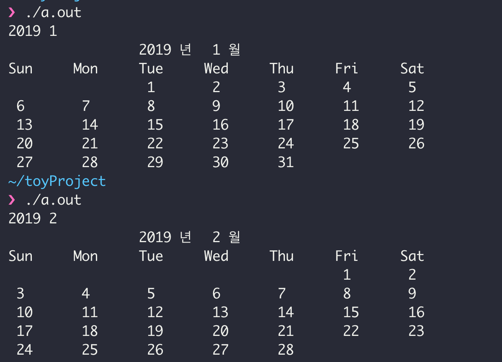

## 8월 9일 (금)

### 오늘 한 일
- 첫 번째 **토이 프로젝트**를 진행했다. 첫 번째 토이 프로젝트는 콘솔 창에 달력 만들기를 선정했다. 처음에는 달력이라서 간단하게 만들 수 있을 것이라 생각했지만 생각보다 쉽지않다. 특히, 년도와 월을 입력받아 해당 년도에 해당 월에 요일과 일수를 출력해주는 함수를 구현 하는 부분이 복잡했다. (E.g. 2019. 8. 입력 시, 2019년 8월달의 달력을 출력해줘야함. )
  - 생각해 본 부분 
    - 입력 받은 월에 1일이 무슨 요일인지를 파악하는게 힘들었다. 특히, 윤년이 존재하여 어떤 식으로 접근을 해야하는지 감을 잡지 못했다 => 사카모토 달력 구하는 알고리즘을 활용해 문제를 해결함.
    - 사카모토 달력 구하는 방법
      - [geeksforgeeks](https://www.geeksforgeeks.org/tomohiko-sakamotos-algorithm-finding-day-week/) 사이트에 정말 잘나와 있다.  
      - 내용 중 이해가 되지 않았던 부분은 전년도 월을 저장하는 t배열에서 -1을 하는 이유이다. 왜 그 부분을 해야하는지를 정말 많이 고민했으며, 수식에서 윤년이 아닌 경우에도 +1을 해주기 때문에 그걸 상쇄 시키기 위한 -1이라는 것을 파악했다. 그 부분을 이해하고 난 후 소스코드를 짜서 프로그램이 잘 돌아가는 것을 확인했다.
      - 달력 알고리즘을 이용해 해당 월의 일자를 구하는 구체적인 방법은 toy project를 기록하는 부분에서 설명하도록 해야겠다.

- shell script 수정 
  - git commit을 하는 스크립트를 수정했다. git에 올리는 명령어를 치는게 귀찮아서 스크립트를 만들었다. 다만, commit comment를 "." 으로 고정해두었는데.. github에 모든 comment 내용이 "."으로 기록되고 내가 어떤 commit을 했는지 식별하는게 어려웠다. 그래서 간단한 comment를 입력받아서 git commit한 후 push하도록 변경하였으며, 만약 인자가 없으면 "." 로 comment를 등록해 push하도록 했다.    - $# 를 이용해 script 내에서 전달된 인자의 개수가 1개 이상인지 파악한 후 comment를 변경하도록 script를 수정했다.

- toy project 시작
  - 첫 번째 토이 프로젝트를 시작하였다. 아직 소스코드를 다듬지도 설계를 하지 는 않았지만 그냥 머리속으로 생각했던 걸 구현한 것 같다. 이제 조금씩 살을 붙어 나가야할 것 같다. [first_toy_project](https://github.com/armkernel/toyProject/tree/master/calender) 

  - 

## 8월 10일 (토)

### 오늘 한 일
- [씹어먹는 C++](https://modoocode.com/217) 중 excel 만들기 강의를 보며 공부를 했다. 어떤 방식으로 프로그램>을 만드는지도 궁금했고 따라 만들면서 생각해보고 구현 하면서 틀리는 점들을 기록해보고자 했다.
  - virtual function 관련해서 궁금한점이 있었다. virtual 함수를 쓸 때, = 0으로 기재하는 부분이 있는데, 그 문법은 어떤걸 뜻하는지 궁금했다.
    -  virtual function_name = 0; 이라고 작성을 한다면 순수 가상함수를 뜻한다.순수 가상함수란, 구현체는 없고 선언 부분만 있는 부분으로 자식 클래스에서 상속 받으면 무조건 구현을 해야하는 부분이다.
    - 순수 가상함수 vs 가상함수
      - 순수 가상함수 : 구현체 없이 오직 자식 클래스에서 구현체를 만들 수 있는 함수
      - 가상함수 : 기본적으로 기반클래스에서 필요한 일부분을 구현해준다. 다만, 자식 클래스에서 필요하다면 수정이 가능하다.

  - 상호 참조 문제가 존재했다. 블로그에 나와있는 내용 중 table에서 cell을 참조하고 cell에서 table을 참조하는
 문제가 존재한다. 현재는 이 문제에 대해 깊게 고민하지 않고 cell에 있는 내용을 주석으로 변경한 후 구현하고 있다. cell에서 table을 참조 해야하는 이유는 무엇이고, 상호 참조 문제가 있을 경우 어떻게 해결할지 공부해야 겠다.

## 8월 11일 (일)

### 오늘 한일
- 씹어먹는 C++의 강의를 따라 만드는 작업을 했다. 현재 Cell을 등록하는 작업까지 따라 만들었으며, print 하는 >부분을 남겨두고 있다. print 하는 부분에 대해 좀 더 연구를 해야할 것 같다.
- 금일 컴퓨터 공부량이 상당히 적은 것 같다. 내일은 좀 더 스퍼트를 올려 컴퓨터 공부량을 많이 만들어야 할 것 >같다.
- blog favicon을 등록했다. favicon 같은 경우 head.html에 link를 통해 등록하며, 각 주요 browser 마다 다르게 >동작하기 때문에 명령어가 다르다.
