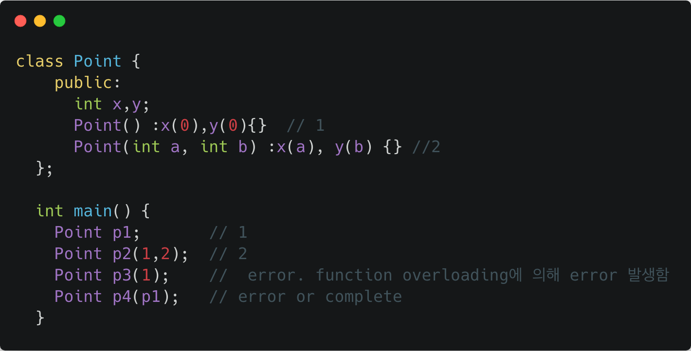

## 8월 26일 (월)
### 오늘 한 일
- C++ 강의를 듣고 정리했다. (more detail private repo)
  - 접근 지시자
  - 생성자
  - 소멸자

- 학회 준비를 했다.
  - 발표자료 수정

### 오늘 회고
- 오늘은 면담을 통해 많은 것을 느꼈다. 모르겠으면, 알아야하고 알려면 공부를 해야한다. 

- 잘한 일
  - 너무 피곤했지만, TIL 기록 및 강의 들은거 정리함
  - 동기부여를 위해 많은 생각과 접근을 해봄
  - 블로그를 하는 것을 절대 중단하지 않기로 함

- 부족한 일
  - 집중이 되지 않는 상태에서 강의를 들어서 흘려 들었던 부분이 많음. 그래서 다시 듣게 되며, 시간을 많이 낭비함
  - 저녁에 집중을 잘 하지 못했다.
    - 우선, 전화를 이용해 발표자료를 수정해야한다는 압박이 존재했다. 
    - 너무 많은 생각을함. (어떻게 해야하겠다.)
  - 오전에 너무 피곤해서 집중이 되지 않았다. 아침에 갈 때, 좀 더 또롱한 상태를 유지하도록 노력해야겠다.

### 내일 계획
- 초기화 리스트 강의 다시 듣기 
- 복사생성자 듣기 
- 실습해보기 
- A tour of C++ 클래스 까지 보기 (오전 11시까지 정리)

- How CC works 부분 정리 (오전 5시 30분까지) 
  - Layer 별 정리 해보기 

- 생활코딩 Git 강의 듣고 정리 
  - Git은 저녁먹은 후 한시간 강의 및 복습 

- TE 외우기 및 복습
  - 한문장 외우기 
  - 20 - 40 까지 복습 

- 복습하는 것에 의의를 둬야한다.

---

## 8월 27일 (화)
### 오늘 한 일
- [TE](https://armkernel.github.io/TE_190827) 한 문장을 외우고 이전 것들을 복습했다.
  - I lost my phone on the subway. I went to the lost and found but couldn't find it. I went to buy a new phone but since I didn't have the old one, I couldn't transfer all contact numbers.

- 복사 생성자, 객체 복사 공부 (more detail => private repo)
  - 객체가 생성될 때 반드시 생성자가 호출되어야 한다.
  - 
  - 위의 코드 중 p4가 완성되려면 Point obj(Point)라는 생성자가 존재해야한다. 즉, 객체를 생성할 때, 같은 타입으로 전달받는 생성자가 존재해야함.
  
  - compiler가 기본 생성자와 동일하게 없다면, 자동으로 만들어 준다. 
  - 컴파일러 입장에서는 기본 생성자와 복사생성자를 만들어 주기 때문에, 둘 중 하나라도 없으면 생성해준다. 다만, 사용자가 생성을 했다면, 컴파일러는 생성하지 않는다. 독립적으로 존재하기 때문에 기본생성자는 사용자가 정의 하고 복사생성자는 정의하지 않았다면, 컴파일러 같은 경우 복사 생성자만 만들어 준다. 

  - 컴파일러가 제공하는 복사생성자는 모든 멤버를 복사한다. 일명 bitcopy라고도 칭함.

  - 복사 생성자가 호출 되는 경우
    - 객체를 만들 때, 자신의 타입으로 초기화 되는 경우 호출
    - 함수 호출 시 인자를 call by value로 전달할 경우
      - const &를 이용해 인자를 전달받도록 함
    - 함수에서 객체를 값으로 리턴할 경우 
      - 참조 반환을 통해 overhead 제거

  - 임시 객체와 RVO (Return Value Optimization)
    - 함수가 전역객체가 아닌 지역 객체를 반환할 경우
      - 지역 객체같은 경우 함수를 벗어나면 파괴 된다. 따라서, 에러가 발생함. 이를 막기위해 만들면서 반환하는 RVO 기법을 사용. 이름 없는 객체를 만들 경우 임시 객체가 생성됨. 

    - 컴파일러 같은 경우 요즘 최적화를 통해서 리턴 값 최적화를 수행한다.

  - 객체 복사
    - shallow copy
      - malloc과 같은 동적할당을 할 경우 문제가 된다. 동일한 주소값을 참조하기 때문에 문제가 됨
    - 해결 방법 
      - deep copy
      - 참조 계수를 위한 복사 
      - move연산 
      - 복사 금지 정책 -> delete keyword 이용 
### 오늘 회고
- C++ 에 대해 많이 알아가고 있는 것 같다. 다만, chromium에 대해 좀 더 공부할 필요성을 많이 느낀다.

- 잘한 일 
  - 복습을 바로바로 했다.
  
- 부족한 일
  - 다른 코드를 볼 때, 집중이 잘 되지 않았다.

---

## 8월 28일 (수)
### 오늘 한 일
-  Static member data 와 Static member function에 대해 공부했다.
-  Const member 함수에 대해 공부했다.
  - member 함수 뒤에 const를 붙일 경우 함수 내부에서는 값을 변경할 수 없어야한다. 즉, 멤버데이터 값을 변경하는 것은 안되며, 함수를 호출해 값을 변경할 수있는 경우도 사용할 수 없다. 즉, const함수는 const 함수만 호출 할 수 있다. 
  - const 함수가 왜 필요한가?가 중요하다.
    - 상수 객체일 경우 상수 함수만 호출 할 수 있다.
    - 멤버함수 같은 경우 보통 외부로 빼거나 다른 파일에 기재한다. 그럴 경우 이 함수에서 값을 변경하지 않는다는 보장을 할 수 없다. 따라서, 이 함수는 내부에서 값을 변경하지 않는다는 것을 보장한다는 const라는 키워드를 붙여줌으로 const 함수라고 알려준다. 
  - 상수 객체는 언제 사용하나?
    - 보통 우리가 값을 변경하지 않는 객체를 넘길 경우 const&로 전달받는다. 그렇다면, 이 객체가 값이 변경없는 print함수 등을 호출할 때 const 함수로 불러야한다. 즉, getter 같은 함수들은 const로 구성되야한다. 

- [TE](https://armkernel.github.io/TE_190828/)를 통해 한 문장을 외웠다.
  - I hate getting on a packed bus during rush hours. So I decided to ride a bike to work. So I got a new bike and a helmat and was so ready for it. However, the bike lanes were not built so well. So I gave up on riding it to work.

- 철학은 어떻게 삶의 무기가 되는가 책을 읽었다.

### 오늘 회고 
- 전반적으로 일에 집중을 한 것은 잘한 것 같다. 다만, 중간중간 집중력이 흐려지는 시간이 존재했다.

- 잘한 일
  - 오픈 소스라는 거대한 산에 이제 발을 담궜다.
  - 최대한 이해 해보고자 했다.

- 부족한 일
  - 집중이 되지 않는 시간이 있었다. 
  - 독서 모임을 해야한다는 압박에 의해 책을 읽는다는 느낌을 많이 받았다. 

- 계획을 세우기 보다는 우선 주어진 일에 집중하고, 하루하루 꾸준히 해나가자.

---

## 8월 29일 (목)
### 오늘 한 일
- [TE](https://github.com/TE_190829) 한 문장을 외웠다.
  - I drank a lot and blacked out last night. I literally don't remember how I got home. I just hope that i didn't do anything stupid. I am going to quit drinking.

- C++ 공부(Lec.)
  - private repo에 정리함
  - 연산자 오버로딩

---

## 8월 30일 (금)
### 오늘 한 일
- [TE](https://armkernel.github.io/TE_190830) 한 문장을 외웠다.
  - I was at lunch and one of the people at my table was eating with his mouth open. His noisy eating bothered me. Furthermore, while he was talking some food spattered onto mine. I couldn't eat anymore.

- C++ 공부 (개인 repo 정리)
  - 연산자 오버로딩 공부
  - smart pointer

---

## 9월 1일 (일)
### 오늘 한 일
- Github blog 댓글 추가
  - Disqus 를 이용해 댓글 기능을 추가했다. 현재 사용하는 스킨 Kiko Now에서는 Disqus 기능을 지원해 훨씬 쉽게 만들 수 있다. short-id만 찾아서 configure file에 적어준다면, 댓글 기능이 쉽게 추가된다.

  - Reference site
    - [Disqus reference site 1](https://khackskjs.github.io/2017/06/22/Setting-Hexo-github-pages/)
    - [Disqus reference site 2](https://devmjun.github.io/archive/addComments)

- [TE](https://armkernel.github.io/TE_190901) 이전의 것들을 복습함.

