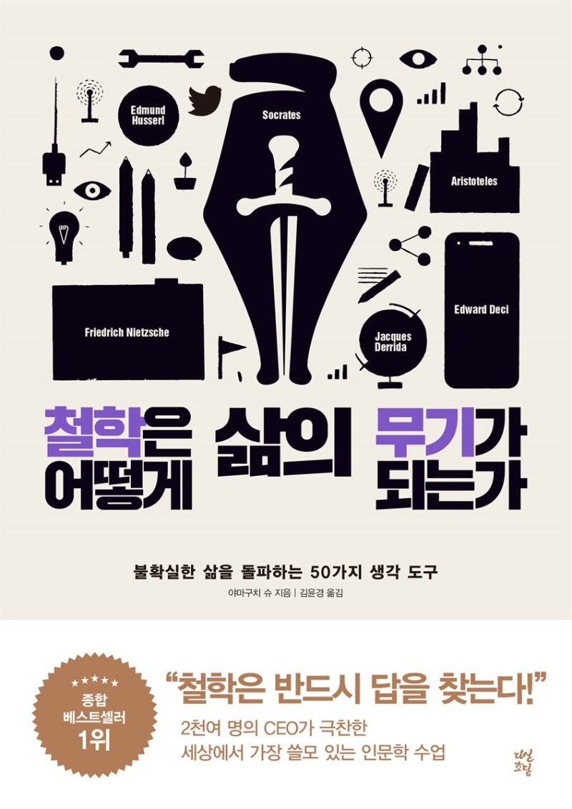

### 철학은 어떻게 삶의 무기가 되는가
- 철학을 되게 쉽게 풀어쓴 책인 것 같다. 읽어보지는 않았지만, 채사장이 쓴 저서 중 재대넓얕 책과 같이 정말 쉽게 넓지만 얕게 풀어쓴 책인 것 같다. 

-  이 책을 읽으면서 좋았던 점은 일반인을 대상으로 쉽게 풀어쓴 점과 실제 인간이 살아가면서 해보아야할 고민들을 질문으로 던졌다는 점이다. 자기 자신을 수양할 수 있는 물음과 자본주의를 살아가는 우리에게 어떤 물음을 던지면 좋을까를 되게 많이 고민한 것 같다는 생각이 들었다.

### 책을 읽고 좋았던 점

#### 성과급으로 혁신을 유도할 수 있을까?
> 에드워드 데시 교수의 연구에서는 대가를 약속하면 피험자의 성과가 저하되고, 예상가능한 정신 측면에서의 손실을 최소한도로 억제하거나 또는 성과급이 기대되는 행동만을 하도록 만든다는 사실이 드러났다. 즉 ***대가를 약속 받으면 높은 성과물을 내려고 최대한 노력을 하는 것이 아니라 가장 적은 노력으로 가장 많은 대가를 얻기 위해서 무엇이든 하게 된다는 것이다.*** 더불어 스스로 과제를 선택할 기회가 주어진다면, 자신의 능력과 지식을 향상시킬 수 있는 도전적인 과제가 아니라 가장 많은 대가를 받을 수 있는 과제를 선택한다.

- 위 내용은 책 내용의 일부를 발췌한 것이다. 책 내용에서는 성과급은 사람을 수동적이게 만들고 혁신을 불러 올 수 없다고 한다. 그렇다면, 우리는 왜 성과급을 이용해 혁신을 내려고 하는 것일까? => 정답은 아니겠지만, 본인의 생각은 1차원적인 고민을 해서 인 것 같다는 생각이 든다.

{: width="130" height="220"){: .center}
