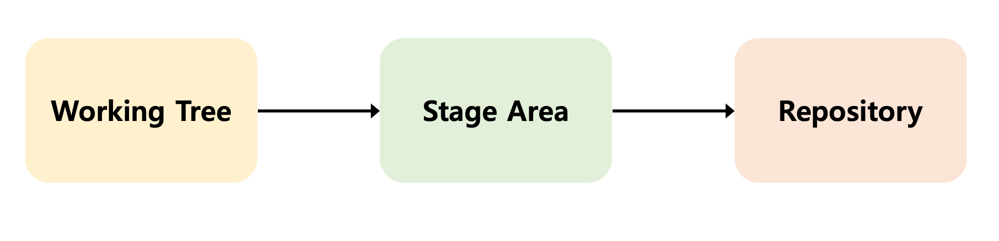

### Git 정리
- 생활코딩의 강의를 듣고 내용을 복습하는 차원에서 블로그에 정리를 하고자 한다. 다소, 매끄럽지 못한 부분들이 존재할 수도 있다. 그런 부분에서는 egoing님의강의를 좀 더 참고해보는 것을 추천한다.
  - [egoing님 강의](https://opentutorials.org/course/3839/22590)

### Git command Line
- 보통 Git을 사용할 때, GUI (Graphic User Interface)가 아닌, CLI(Command Line Interface)를 사용한다. Command line 같은 경우 불필요한 GUI operation들이 존재하지 않기 때문에, 속도가 빠르다. 만약 익숙해진다면, 단축키까지 활용해 엄청난 효과를 볼 것이다.
- CLI의 가장 좋은 점은 ***명령어 조합*** 이다. Command line에서 명령어를 조합하여 하나의 명령어처럼 사용할 수 있다.

### Git 버전관리
- 임시 폴더를 하나 만들고 이후 init 명령어를 통해 "내가 이제부터 version 관리를 할 것이라고 알려주는" 폴더를 생성한다.
  ```sh
    $ mkdir git_practice
    $ git init git_practice
  ```
- git 이라는 폴더 내에 생긴 정보들은 version number를 관리할 때 사용하는 자료들이다.
- 만약, .git 폴더 자체를 지우게 된다면, 우리가 관리하는 버전들이 다 사라지게 되며, 근본없는 프로젝트가 될 수 있다. 이를 막기 위해 보통 서버에다 백업을 해두게 된다.



- 프로젝트에 사용되는 파일들 중 일부를 변경했을 경우 변경사항들을 version으로 관리.
  - Git flow..
    - 우리가 파일을 만들고 수정함. 아직 version이 만들어지지 않은 단계는 ***Working tree*** 단게라고 함.
    - 우리가 수정한 파일 중 일부를 선택하여 (또는 다 선택가능) version을 만듬. version을 만들기 위해 필요한 파일들이 있는 단계를 ***Staging area***라고 함.
    - 변경된 파일의 version을 만드는 동작을 ***commit***이라고함.
    - Git에서 각종 version들이 저장되는 곳을 ***repository***라고 함.

#### Config, Add, Commit
- Config - Git 내부에서 사용하는 환경설정(e.g. 계정)을 담당하는 명령어 
```sh
  $ git config --list # git의 환경설정을 보는 명령어

  # git 설치후 가장 먼저 할일은 user.name과 email을 설정하는 일이다.

  $ git config --global user.name "사용자 정의 이름" # 이름 설정
  $ git config --global user.email "사용자 정의 메일" # email 설정
```

- Add - 사용자가 변경한 파일 들 중 어떤 파일을 working tree -> staging area로 옮길 지 선택할 때, 사용하는 명령어

- Commit - staging area에 담긴 내용을 이용해 version을 만든다. 이후 version을 repository에 저장하는 동작까지 수행함.
  - commit과 add를 한번에 하기 위해서는 commit -a 라는 옵션을 추가해주면 된다.

```sh
  $ git add . # 현재 파일에 변경된 정보를 모두 넣어라는 뜻
  $ git commit # commit message를 적으라는 editor가 뜬다. 만약 editor를 띄우지 않고 간소화 작업을 하고 싶다면, (-m) 옵션을 추가한 후 간단한 commit message를 적으면 된다.
```

### Status, Log
- Status - 현재 git의 상태를 보여주는 명령어. 가장 많이 사용하며, 어떤 단계에 있는지를 확인할 수 있다.

- Log - version에 대한 history를 볼 수 있다.
  - 쉽게 보기 위해서는 "tig"라는 실행파일을 이용하면 된다. (다운 받아야 사용가능)


