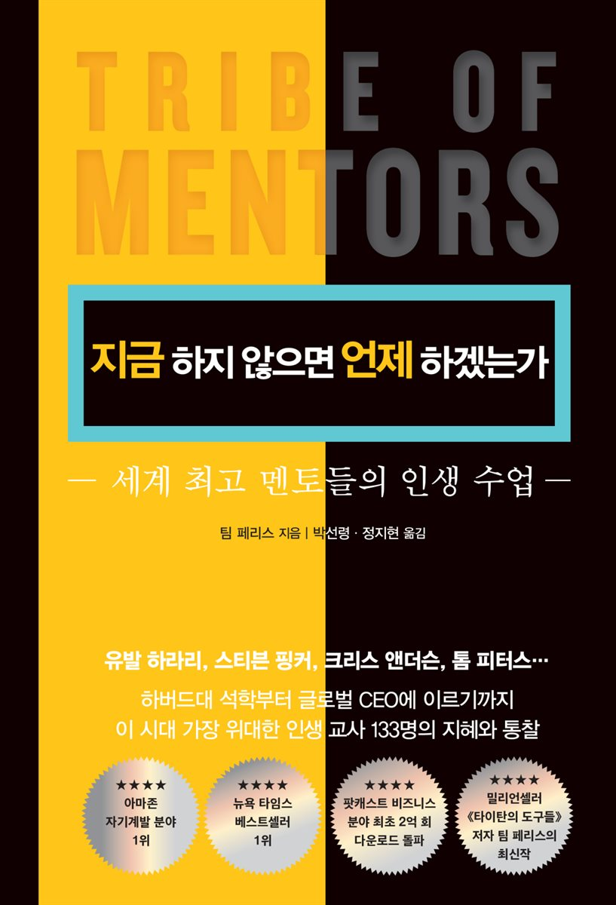

### 지금 하지 않으면 언제 하겠는가
- 오랜만에 자기계발서가 읽고 싶다는 생각이 들었다. 요즘 자기계발 보다는 경제 서적을 많이 읽다보니, 자연스럽게 자기계발서에 대해서는 멀어진 느낌이 있다. 열심히 살자라는 일념하에 하루를 완벽하게 보내려다 보니 번아웃이 온 것 같다는 생각이 든다. 번아웃이 온 이후 자연스레 떠오른 생각, "왜 이렇게 나는 바쁘게 살아야하지? 언제 까지 바쁘게 살아야하나?" 라는 생각이 들었다. 책을 읽는다고 답은 나오지 않겠지만, 어떤 한 구절이 나를 움직이게 할 것이다 라는 막연한 희망으로 책을 읽은 것 같다.

- 본 도서는 수 많은 연사들과 팀 페리스가 대화를 나누면서 느꼈던 생각들을 엮어 쓴 책인 것 같다. 팀 페리스는 이 책 말고도 자기계발 분야의 다른 서적들을 많이 출판하였다. 저자의 다른 저서들과 차이를 본다면, 이번 도서는 명사가 던지는 본질을 자기사례에 잘 녹여서 독자로 하여금 쉽게 읽을 수 있도록 한 것이라 생각한다.

- 책을 읽으면서 본인의 관점을 만들어 가는 것도 중요하지만, 이번 책 같은 경우 좋은 구절들을 필사를 많이 하면서 읽은 것 같다. 필사를 하며 읽으니 문장들의 울림정도에서 많은 차이가 있었다. 평소에는 사소하게 지나칠수도 있는 문장임에도 필사를하며, 내 상황에 빗대어 읽다보니 울림이 달랐던 것이라 생각한다. 다소 오래걸린게 단점이긴 하다..

### 책을 읽고 좋았던 점

> 빅터 프랭클의 죽음의 수용소 중에서는 이런 구절이 등장한다. "성공을 목표로 삼지마라. 성공에 초점을 맞추면 맞출수록 더욱 더 멀어질 뿐이다. 성공이나 행복은 의도적으로 찾을 수 있는 것이 아니라 자연스럽게 찾아오는 것이다." 쉽게 풀어쓰자면, 내면의 소리에 귀를 기울이고, 그것이 원하는대로 확실하게 행동할 것을 권한다.

>  어떻게 살것인가? 라는 질문은 끔찍한 질문이다. 앞으로의 5분을 생각하는 것이 더 효율적이다. 우리가 어떻게 살아갈 것인가라는 생각을 가진다고 해서 개혁이나 혁신이 일어나지 않는다. 개혁과 혁신도 앞으로의 5분에 어떤 행동을 취할지에서 나타난다. 행복 또한 동일하다. 앞으로의 5분 동안 우리가 뭘해야 행복할지 고민해야한다.

> 우리가 늘 하는 말.. '시간이 좀 더 있었다면.. , 주어진 환경이 괜찮았다면.. ' 앞의 말과 같이 모든게 충분하고 넉넉하다면, 우리는 분명 더 나은 결과를 얻을 수 있다. 그렇다면 역으로 질문을 해보자. " 왜 더 성공적인 결과를 얻는데 필요한 시간을 들이지 않는가?"  어떤 일을 하기 위해 또는 어떤 결과를 얻기 위해 우리는 충분한 시간을 투자해야한다. 즉, 시간을 제대로 써야한다.

> 사람은 하고싶은 일을 하면서 살기 원한다. 하지만 가장 주의해야할 점은 기댈 수 있는 재정적 쿠션을 만든 후 하고 싶은 일을 하도록 해야한다는 점이다. 재정적 쿠션이 없는 한 사람은 흔들리고 불안하게 된다. 가장 위험한 생각은  ***좋아하는 일을 할 수 있다면, 삶의 대부분을 포기할 수 있다***  이다. 

> 최고가 되어라. 붐비지 않는시장이다.

> 최고가 되고 싶다면, 읽고 읽고 또 읽어라. 뛰어난 사람은 독서광이다. 요즘 같이 스피디한 시대에 책을 탐독하는 사람은 찾기 힘들다. 반대로 고려해보자면, 책을 읽으면 최고가 될 수 있는 확률이 올라간다는 것이다.

> 창의 적인 삶을 살려면 과정이 아닌 결과로 부터 자유로워야 한다.

{: width="130" height="220"){: .center}
