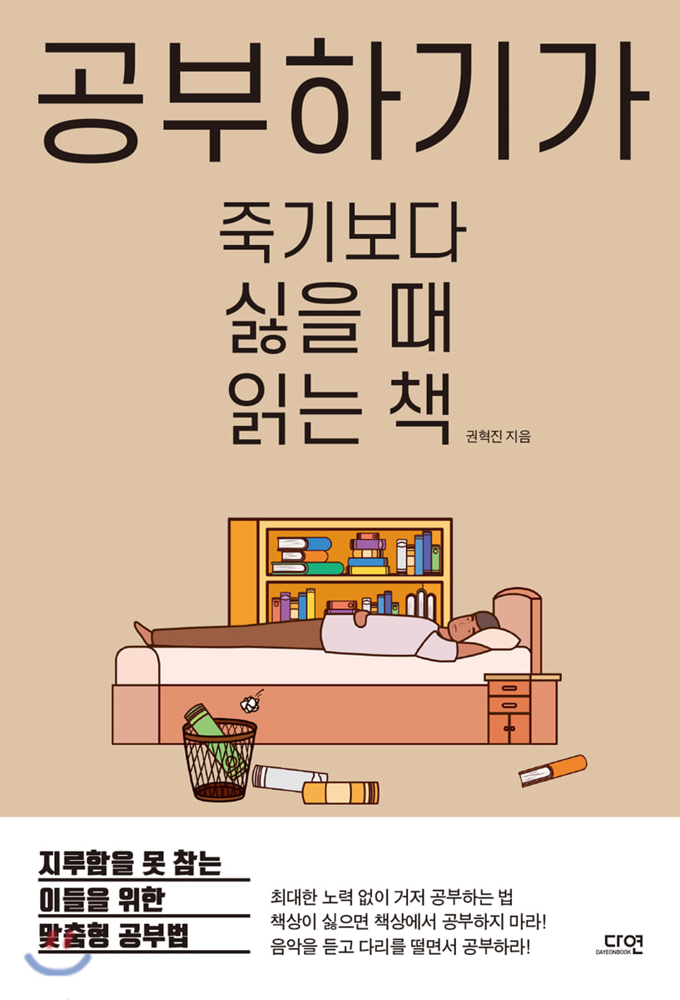

### 공부하기가 죽기보다 싫을 때 읽는 책

- 약간의 무기력과 메너리즘에 빠져들었던 날, 서점에서 이 책을 샀다. 처음에는 제목이 자극적이여서 책 내용을 보고 쉽게 읽을 수 있게구나 하고 구매했다. 저자의 이력이 독특했는데, 금융쪽으로 공적인 일에 종사하다 30대에 수능을 다시보고 한의대를 갔다고 했다. 지금은 한의대를 다니면서 틈틈히 시간을 내 책을 작성한 것으로 알고 있다. 

- 솔직히, 책 내용은 자기계발 내용이고 어디서 들어본 듯한 내용들이 많이 즐비해있다. 그 중 가장 기억에 남 는 것은 공부를 실증나게 하는 요소들을 하지말라는 것이다. 우리가 되게 간과 할 수 있는 부분을 잘 꼬집었다고 생각한다. 보통 공부를 할 떄, 열심히 해야돼.. 음악을 들으면 집중이 안될거야.. 초콜릿 먹으면 살쪄.. 등등 무수한 생각이 오고간다. 이런 생각들을 억제하는 행위가 공부를 실증나게 한다고 주장한다. 저자는 공부를 함에 있어서 하고 싶은 욕구를 억제하지 말고 행할 수 있는 것들은 행하면서 공부를 즐거운 것으로 인식시키는 것이 중요하다고 말한다. 예를들면, 공부를 하다가 배가 고프면 그냥 초콜릿이나 뭘 먹으면서 하면된다. 배가고픈 상태로 공부를 계속하는 것은 "짜증나고 답답한 것 = 공부" 라고 인지된다. 

- 최근들어 공부가 실증하고 재미없게 느껴지곤 했다. 이 책을 읽으면서 어떤 것들이 나를 실증나게 하는지 고민해볼 수 있는 계기가 될 수 있어 좋았던 것 같다. 

{: width="130" height="220"){: .center}

