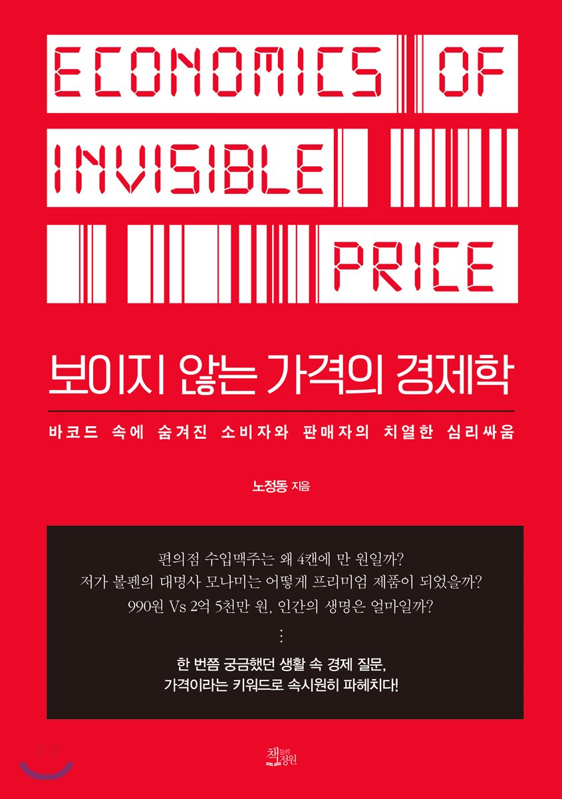

### 개인적 생각
- 보이지 않는 경제학을 읽고 가격에 대해 다시 한번 생각해보게 되었다. 가격을 책정하는데 있어 무수히 많은 이해관계가 얽혀있다는 것 (e.g. 정치적, 경쟁사, 법적 규제, 소비자 트랜드 등)을 알게되었다. 사업가는 전략을 가지고 있는 전략가와 비슷하다는 생각을 했다. 어떤 전략을 취하느냐에 따라 사업이 성장하느냐 마느냐가 달려있구나를 책을 통해 많이 느꼈던 것 같다. 기존의 이론적으로 알고 있었던 개념이 좀 더 정리가 되는 느낌이여서 좋았다.

- 재밌었던 내용
  - 우리가 국산이라고 칭하고 있는 하이트 맥주와 카스 맥주의 뿌리가 일본이라는 것을 알게된 것이 가장 신기했다. 강화도 조약 이후 맥주가 일본으로 부터 유입되게 되었고 그 맥을 이어받아 하이트와 카스가 됐다는 말이 신기했다.

  - 스티브 잡스 같은 경우 소비자 조사를 하지 않는 다는 점이 신기했다.

  - 이디야의 창업가와 소비자를 잡고자 하는 전략은 정말 예술이였던 것 같다. (고급화 전략을 뒤집고 창업가를 끌어들였단 점에서 아주 칭찬할만하다...)

{: width="130" height="220"){: .center}
