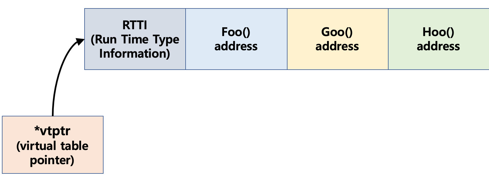

### 가상함수의 이해

- 상속을 받은 후 동일한 함수를 재정의 하였을 때, 사용하는 것을 override라 하며 재정의된 함수를 <mark> 가상함수 <mark> 라 칭한다. 

```c
#include <iostream>

using namespace std;

class Animal
{
public:
  void cry() { cout << "1" << endl; }
};

class Dog : public Animal
{
public:
  void cry() { cout << "2" << endl; }
};

int main()
{
  Animal a; a.cry();
  Dog d; d.cry();

  Animal* p = &d;
  p->cry();
}
```

- 위 코드의 경우 어떤 결과의 출력 결과의 a.cry()와 d.cry()는 각 객체 내 멤버함수를 호출하기 때문에, 출력 결과를 예상할 수 있다. 하지만, p\-\>cry() 는 어떤 결과를 출력할 것인가?
  - p\-\>cry()를 어느 함수에 연결시킬 것인가에 대한 결정을 하는 것을 binding이라고 칭한다.
    - binding의 종류는 2가지로 나뉜다.
      1. static binding
        - c++, c#에서 사용됨.
        - 컴파일 시간에 binding 되는것을 말함.
        - 타입만 보고 결정하기 때문에 비논리적.

      2. dynamic binding
        - java, swift, kotlin 등에서 사용됨.
        - 실행시간에 binding을 함
        - 타입이 아닌 메모리에 지정된 위치에서 함수의 주소를 읽어와 매칭 시켜줌
        - 타입을 보고 하는 것이 아니기 때문에 논리적임.

  - 위와 같이 pointer로 받을 경우 우리는 p가 확실하게 Animal\* 타입이라는 것만 알 수 있다. 우변에 적힌 값은 실행시간에 바뀔 수 있기 때문에 결과를 알 수 없다. 하지만, compiler 입장에서는 Animal 타입이라는 것은 확실하게 알 수 있다. C++이라는 언어에서는 static binding을 하기 때문에 ***결과는 1*** 이 출력된다.

- C++은 다른 언어에 비해 모든 함수들을 static binding으로 연결 시킨다. 따라서, 다른 언어보다 빠르게 동작한다. 하지만, 논리적이지 못한 경우들이 발생한다. 이를 막기위해 c++에서는 ***virtual*** 키워드를 제공해 static binding이 아닌 dynamic binding을 할 수 있도록 한다.

### Virtual Table
- dynamic binding을 하기 위해서는 메모리의 한 영역에 실제 호출해야하는 함수들을 저장해야한다. 이런 함수들의 위치를 저장해둔 장소를 ***Virtual Table*** 라 한다. 

```c
class Animal
{
  void* vtptr; // compiler가 넣어주는 코드
public:
  Animal() : vtptr(animal_table)

  virtual void Foo() {}
  virtual void Goo() {}
  virtual void Hoo() {}

  ...
};

```

- 위와 같은 클래스가 존재할 경우, 내부적으로 virtual table을 형성하고 compiler는 클래스 내 vtptr을 넣어준다. 이후 생성된 테이블과 연결 시켜준다. 만약 virtual keyword가 클래스내 존재하고 상속이 이루어진 클래스라면, 파생클래스에서 함수를 호출 할 때, virtual table을 확인해 호출한다.



- 위 그림은 가상함수로 구현했을 경우 가상테이블이 만들어진 결과물을 나타낸 그림이다.
- 가상함수 테이블은 재정의한 함수를 제외한 나머지 함수들은 다 상속받으며, 파생클래스에서는 새로운 가상함수 테이블을 갖게 된다. 따라서, 메모리가 많이 늘어나 overhead가 많이 발생한다. 이를 해결하기 위해 virtual을 쓰지 않는 CTRP 기법을 많이 활용한다.


