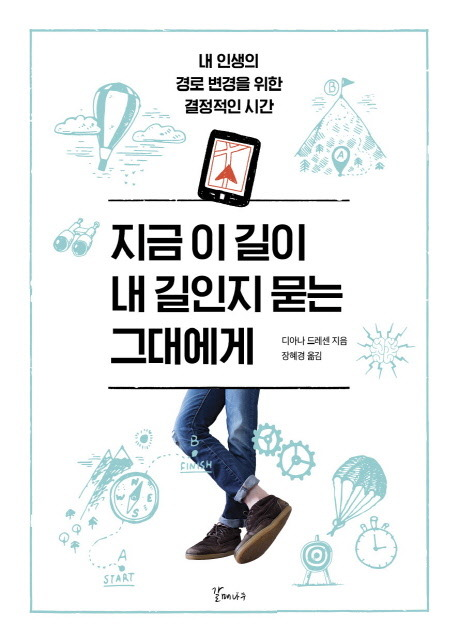

### 지금 이 길이 내 길인지 묻는 그대에게
- 요즘들어 책을 많이 읽지 않다고 생각이 들어서 동기부여를 얻기 위해 골랐던 책이다. 우선, 책이 좀 얇은 책으로 읽는 즐거움을 찾기 쉬울 것 같아서 골랐다. 책의 내용은 제목에서 부터 예상가능하게 자기계발 내용을 쭈우욱 나열한 것 같다. 생각보다 동기부여가 됐던 문장들은 발견하지 못해 약간의 아쉬움이 남는다. 하지만, 책을 읽다가 많이 들었던 생각은 "요즘 내가 집중하는 시간을 많이 잃어 버린건 아닐까?" 라는 생각이다. 사회적 이슈에 많은 관심을 가지다 보니 순간적으로 집중하거나 내가 정말 이뤄야 하는 일에 대해 집중을 하지 못하는 모습을 순간순간 느낄 때가 많다. 그런 걸 줄여야지 하는 의지를 많이 가지고 있지만 잘 안되는 것 같다. 역시 환경을 구축하는게 변화를 줄 때 가장 좋은 방법이 아닐까 다시한번 상기 시켰다. 

- 책을 읽으면서 좋은 점은 지식을 얻는 것, 생각을 정리하는 것 등등이 있는데 내가 가장 좋다고 생각하는 점은 "몰입하는 것" 인 것 같다. 요즘.. 생각을 정리하고 하나에 빠져드는 시간이 얼마나 되는가? 많지 않다라고 답할 것 같다. 이제 책을 읽어야 겠다고 생각을 많이 했다. 퇴근 후 20분이라도 책을 읽는 습관을 들여보자. 열심히해 지식을 얻어야지 보다는 몰입하는 시간을 찾자에 초점을 맞추자.

#### 기억에 남는 부분
> 오른쪽이 막혔으면 왼쪽으로 가라. 너무 한쪽으로 치우치게 되면, 시야가 좁아질 수도 있다. 모든 걸 해결할 수 있는 사람은 없다. 다만, 유연하게 해결 할 수 있는 사람들은 많다고 생각한다. 인생은 엄청 얽혀 있고 하나씩 풀어나가는 과정이라고 생각한다. 따라서, 오른쪽으로 가다가 길이 막혔을 때, 크게 숨을 들이 마시고 한번 둘러보는 노력을 하자.

{: width="130" height="220"){: .center}
