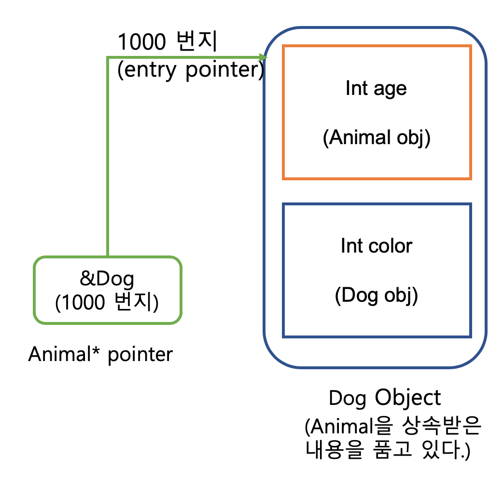

### Intro
> Upstream의 개념에 대해 알아보자

- Upstream이란, 부모의 포인터를 이용해 자식의 객체를 참조할 수 있는 것을 의미한다.

```c
class Animal
{
  int age;
public:
  Animal() { cout << " Animal " << endl };
};

class Dog : public Animal
{
  int color;
public:
  Dog() { cout << " Dog " << endl; }
};

int main()
{
  Dog d = new Dog;
  
  Dog* dp = &d; // ok..
  double* dp1 = &d; // error..

  Animal* dp2 = &d; // ok.. upstream!
}
```

- 위의 소스코드와 같이, 포인터로 참조할 수 있는 케이스들이 다양하다. 우선, 첫 번째, Dog로 자기자신과 동일한 타입을 가리킬 경우 성공한다.(당연하다..) 만약 다른 타입인 double 타입으로 가리킬 경우 타입이 달라 실패한다. 하지만, Animal.. 기반 클래스지만 타입이 다른 형태로 Dog를 가리킬 경우 두 번째 케이스와 같이 실패해야할 것 같지만.. 실패하지 않고 성공한다. 이를 <mark> Upstream </mark> 이라한다.

#### 왜 타입이 실패하지 않고 성공하는가?
- 메모리 그림으로 확인해보자.


- 위 그림과 같이 Dog 객체 같은 경우 Animal 객체를 상속받기 때문에 상속받은 걸 품고 객체가 만들어 진다. 따라서, Animal 포인터에 Dog객체의 주소를 넣어도 시작 주소로 따라가본다면, Animal이 있다는 것을 알 수 있다. 즉, Animal 포인터 같은 경우 Animal을 상속받은 객체(파생 클래스) 들을 다 가리킬 수 있다. ***이 개념이 Upstream의 핵심***이다. 
