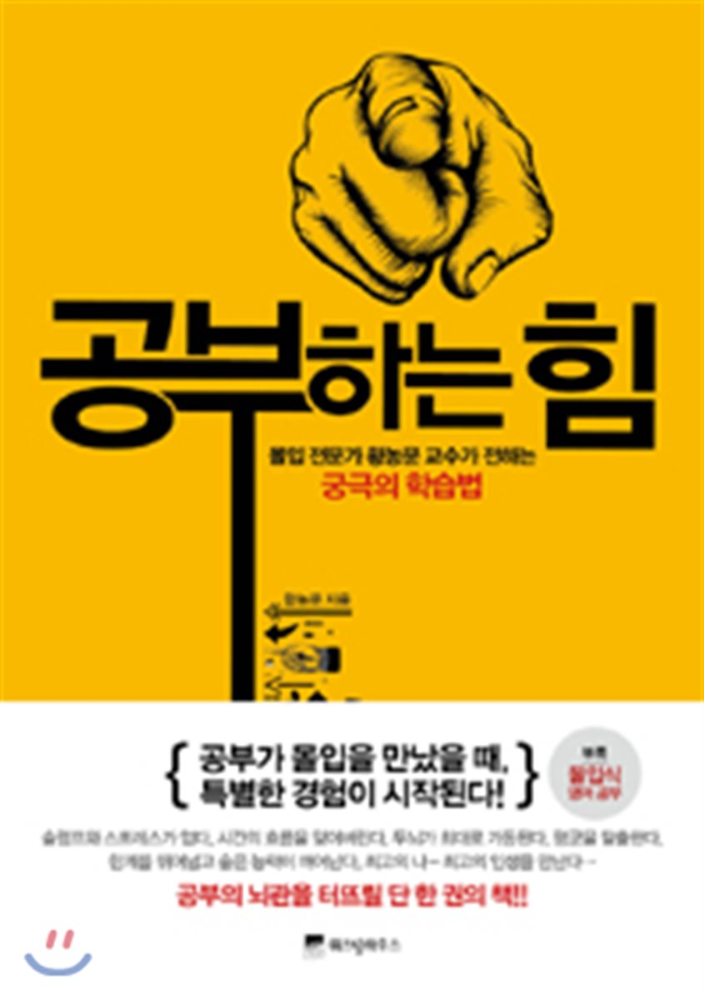

### 공부하는 힘

### 책을 읽고 좋았던 점
> 주어진 실험적 사실이 같더라도 이로부터 끄집어낼 수 있는 참의 명제의 양은 개인의 사고력에 따라 천차만별이다. 예를들면, 사과나무에서 사과가 떨어진다는 사실은 수 많은 사라들이 관찰했지만, 뉴턴만이 이 사실에서 만류인력이란 참의 명제를 끄집어냈다. 즉, 사고력이 높을 수록 동일한 사실 정보에서 더 많은 양의 참의 명제를 이끌어낼 수 있다.

- 아무리 많은 지식이 있더라도 사고력이라는 첨가물이 없다면 무용지물이구나 라는 걸 알게되었다. 연결의 기본은 사고력인 것 같다는 생각을 해본다.

> 기억은 2가지로 나뉜다. 시험은 책이나 참고서에 있는 내용을 안 보고 문제를 풀 수 있는 능력을 주로 테스트하는 것이다. 나중에 더 자세히 소개하겠지만 시험에서는 주로 외현기억explicit memory. 미지의 문제를 해결할 수 있는 능력, 즉 누구도 미처 생각하지 못한 유용한 사고를 하는 능력이 바로 창의성이다. 창의성은 강의를 들어서 습득될 수 있는 것이 아니고 적절한 경험을 반복함으로써 체화된다는 점에서 외현기억보다는 암묵기억implicit memory.

- 용어는 중요하지 않다. 다만, 우리나라의 현실을 잘보여주는 것 같다는 생각이든다. 교육적인 측면에서 우리는 외현기억을 중요시하는 것 아닐까 하는 생각이든다. 

> 많은 분량의 지식을 주입받은 대부분의 소년이나 청년들은 정신 능력이 강화되기보다는 오히려 많은 지식으로 말미암아 지나치게 무거운 짐을 진 셈이 된다. 그들은 오직 다른 사람들의 견해나 말투를 주입받는다. 그리고 그들 자신의 견해를 형성하는 대신 다른 사람들의 견해를 받아들이는 데만 익숙해진다. 그리하여 자녀 교육에 아무런 수고도 하지 않는 아버지를 가진 아이들은 배운 것을 그저 앵무새처럼 외는 것밖에는 하지 못하는 경우가 많다.
그러나 내가 받은 교육은 그런 주입식 교육이 아니었다. 아버지는 무엇이든 배움이 단지 기억력 훈련이 되는 것을 절대 허락하지 않았다. 그는 배우는 모든 단계를 이해하도록 힘썼을 뿐 아니라 가능하면 가르치기에 앞서 내가 스스로 이해하게 하려고 노력했다. 나 스스로 해답을 찾기 위해 온 힘을 다하기까지는 절대로 미리 알려주지 않았다. (존 스튜어트 밀, 『존 스튜어트 밀 자서전』, 최명관 옮김, 창, 2010)

- 두 번째 내용과 비슷하다. 두 번째 내용은 이론적으로 풀었다면, 이번 내용은 좀 더 잘 풀어 쓴 내용이다. 이 글을 보면서 현재 우리나라에서 입시제도를 논하고 있는 것에 대해 많은 생각을 하게되었다. 요즘 입시제도에서 문제가 되는게 수시 비중이 높아지는 건 금수저를 위한 정책이다 라는 것이다. 돈이 많은 사람들에게는 수시를 준비할 여건이된다. 출발선상에서부터 불공정한것에 대해 동의한다.위 문장을 보고 정시로 돌아가는게 맞는 것일까? 하는 의문이 든다. 규제를 통해 공정한 사회로 나아가는 방법은 없는 것일까? 하는 생각이 들기도 한다. 마땅한 정책을 내놓을 능력은 되진 않지만, 이런 능력을 가진 정치인이 있다면 유심히 지켜볼 생각이다.

> 이 짜증이 심적 부담으로 작용해서 몰입도를 올리기가 한층 어려워진다 그러나 이 짜증이 나를 각성시키는 효과도 있다. 지금처럼 바보같이 생각해서는 문제가 풀리지 않으니 조금 더 날카롭게 생각하라고 내적으로 질책하는 것이다.

- 짜증이라는 상황을 너무 나쁘게만 바라보지말자. 이런 관점도 있다.

> 최고의 실력을 발휘하는 사람들은 공통적으로 소위 ‘신중하게 계획된 연습’을 했다는 것이다. 전문가들이 말하는 신중하게 계획된 연습의 특징은 세 가지다. 첫째, 자신의 한계를 넘는 시도를 해야 한다. 둘째, 결과에 대한 피드백을 받아 오류를 즉각 수정해야 한다. 셋째, 첫째와 둘째의 방식을 끊임없이 반복해야 한다.

{: width="130" height="220"){: .center}

