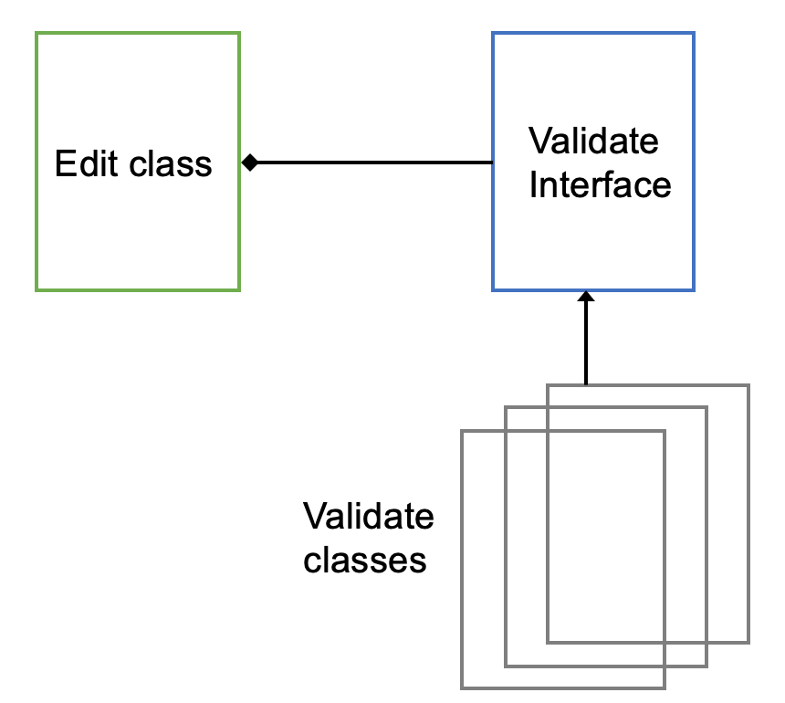

### Intro
> 변하지 않는 부분에서 변하는 부분을 나누는 2가지 방법에 대해 배워보고 차이점을 비교해보자.

#### 변하는 부분과 변하지 않는 부분
변하는 부분과 변하지 않는 부분을 나누는 방법은 2가지가 존재한다.
 - 가상함수를 이용하는 방법
 - 새로운 클래스를 이용하는 방법

#### 변하는 부분을 가상함수로 추출

```c
 string getData()
  {  
    // cin >> data;
    data.clear();
    while(1)
    {
      char c = getchar();
  
      if(c == '\n') break;
      // ------------------------
      if(isdigit(c)) { // 변경되는 부분.
      // ------------------------
        cout << c;
        data.push_back(c);
      }
    }
    cout << endl;

    return data;
 }
```

- 위의 코드와 같이 <mark>변경되는 부분 </mark>이라고 표기된 주석을 보자. 실질적으로 정책을 변경하는 부분이다. 현재 적용된 정책과 같이, 숫자인지 아닌지를 판별하는 부분이다. 이 부분을 따로 추출해서 관리한다면, isdigit() 를 !isdigit() 등과 같이 변경할 수 있다. 즉, getData() 를 수정하지 않고 정책적인 부분만 변경하면 된다. 이 정책을 뽑아서 사용하기 위해 ***가상함수 기법***을 이용한다.

```c
class Edit
{
public:
  // 여기가 핵심..
  virtual bool validate(char c) 
  {
    return isdigit(c); // c가 숫자인지 아닌지를 판별해 bool값을 넘겨줌.
  }
  
  string getData()
  {
    // ... 부분은 이전에 작성해 둔 코드를 의미한다. 
    // 소스코드가 너무 길어지는 것을 방지.
    ...
    if (validate(c)){
    ...
  }
};
```

- 위의 함수와 같이, 실제 정책을 이용하는 부분에서 validate라는 가상함수를 만든다. 이후 가상함수에서 실질적으로 적용해야하는 정책을 적용하도록 한다. 이렇게하면 뭐가 좋은가? 
  - 파생클래스로 재정의해서 내가 필요한 정책을 재정의 할 수 있다.
  - 예를들어 내가 주소를 입력 받아야하는 정책을 만들어야 한다고 해보자.

```c
class AddressEdit : public Edit
{
public:
  virtual bool validate(char c)
  {
    // 주소는 숫자와 문자를 다 받을 수 있기 때문에 true를 반환하면 됨
    return ture;
  }
};
```

- 위의 AddressEdit 클래스와 동일하게 validate를 상속받아 정책을 정의한 후 AddressEdit 객체를 만들어 getData()를 호출하도록 하면 된다. 그럴 경우 가상함수 RTTI 기법에 의해서 파생클래스의 재정의된 함수가 호출되는 것을 확인할 수 있다. [RTTI 내용 참조](https://armkernel.github.io/lec_cpp_1/)


#### 변하는 부분을 클래스로 추출
- 변경되는 부분을 추출하는 또 다른 방법은 새로운 클래스로 설계하면 된다. 새로운 클래스를 설계할 때, 이전에 제시된 문제와 동일한 문제를 만들지 않기 위해 강한 결합이 아닌 약한 결합으로 설계한다. 즉, Interface를 만들어 접근하도록 한다. Interface를 만들면 내부 구조를 파생클래스에서 재정의 가능하며, Upstream으로 인해 포인터로 접근이 가능하다. 

{: width="250" height="200"){: .center}

- 위의 그림과 같이 인터페이스를 설계하면 된다. Edit에서는 validation 관련 클래스를 전달받도록 하며, validation은 다양한 파생클래스로 구현 되어져 있으면된다. validation 내 함수는 사용자가 정의를 하면 된다. 다만, 인터페이스에 들어가야하는 함수들은 공통적으로 구현해야하는 함수를 넣어주면 된다. 인터페이스에서 virtual함수를 구현해도 되지만, 보통 순수 가상함수로 만들어 구현체들에서 실질적인 역할들을 구현하게 하는 것이 좋은 디자인이다.

```c
struct IValidator
{
  virtual bool validate(char c) = 0;
};

class Edit
{
  IValidator* pVal = nullptr;

public:
  void setValidator(IValidator* p) {
    pVal = p;
  }

  string getData()
  {
    ...
    if ( pVal->validate() ){
    ...
  }
};
```

- 위의 코드와 같이 Interface를 구현한 후 setter를 이용해 전달받아 사용하면 된다. validate는 구현체를 만들어 구현해야한다. 구현체의 정책은 사용자가 정하는 것이며, rule을 먼저 정하는 것이 중요하다.

- 주민등록번호를 받는 Editor box를 구현해보자. 
  - 필요한 정책
    - validate -> 주민 번호는 숫자만 들어와야한다.
    - check -> 주민번호를 다 입력받았는지 확인할 필요가 있다.
      - 숫자가 다 입력되지 않은 상태에서 getData() 호출이 된다면 잘못된 데이터를 입력받은 것이다.
      - 이 부분을 확인해 13자리가 다 입력될 때까지 기다려야한다.


- 전체적인 흐름의 변경없이 변경하는 부분을 추출해 변경하는 디자인 기법을 <mark>Template Method design pattern</mark> 이라고 한다.
