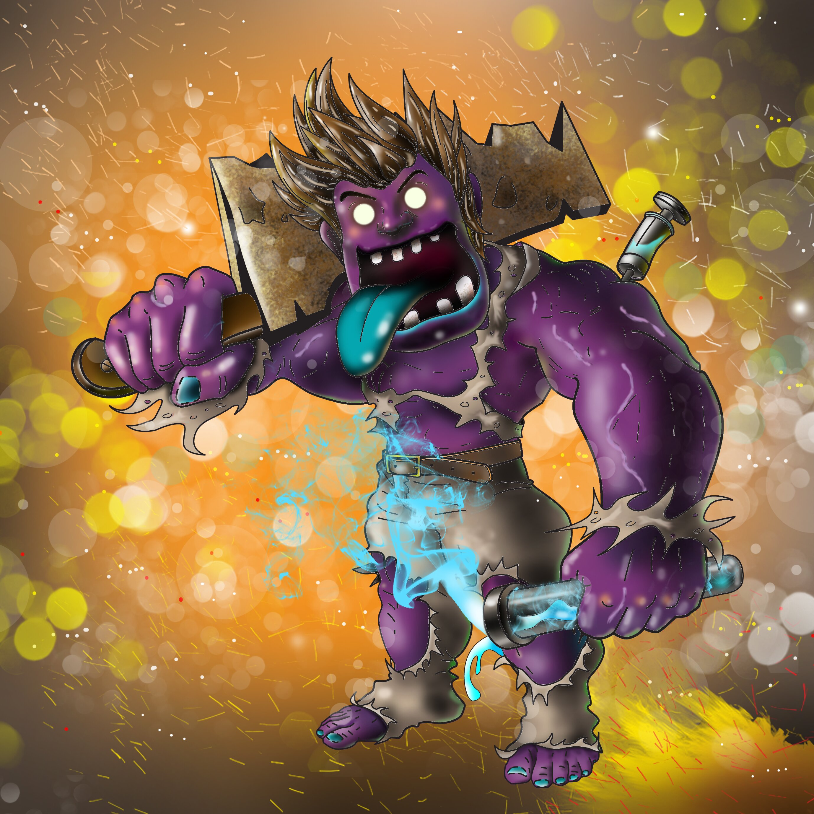

### Intro
- State pattern에 대해 알아보자.

#### 메이자스토리를 생각해보자
- 

- 게임을 즐겨본 분들이라면, 위 사진에 나와있는 케릭터를 가지고 많은 일을 할 수 것을 알 수 있다. (e.g. 공격, 달리기, 아이템 줍줍 등)
  - 그렇다면, 이런 케릭터는 어떻게 객체로 표현할 것인가?
  - GUI 로 표현하기에는 너무 많은 일을 하여야 하기 때문에 디자인 패턴 관점에서 본다면, 단순한 콘솔로 표현 할 수 있을 만큼으로 객체데이터를 제한해보자.


#### 단순한 케릭터 객체

```c
class Character
{
  int item = 0; // 다양한 아이템이라면, vector가 될 수도 있다.
public:
  void run() { cout << "run" << endl; }
  void attack() { cout << "attack" << endl; }
};

int main()
{
  Character* c;
  c->run();
  c->attack();
}
```
- 위와 같이 하나의 캐릭터는 아이템도 먹을 수 있고, 달릴수도 있고 심지어 공격도 할 수 있는 케릭터라고 생각해보자.. 사진과 같이 <mark>문도 박사</mark> 라고 생각하면 편할 것 같다:)
