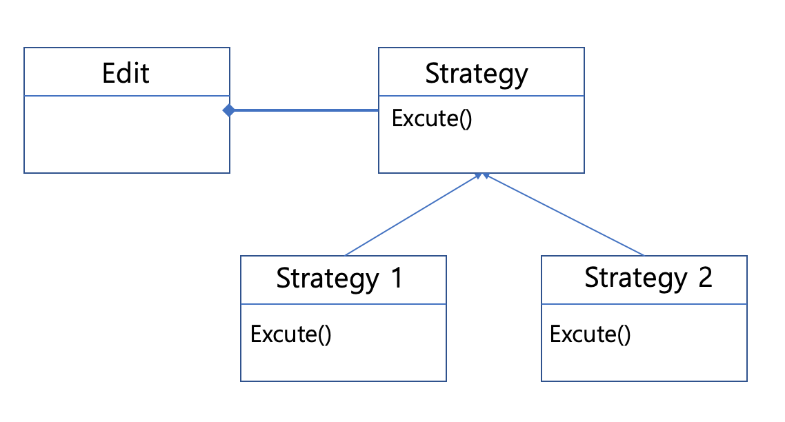

### Intro
- State pattern에 대해 알아보자.

#### LOL을 생각해보자
{: width="210" height="200"}{: .center}

- 게임을 즐겨본 분들이라면, 위 사진에 나와있는 케릭터를 가지고 많은 일을 할 수 것을 알 수 있다. (e.g. 공격, 달리기, 아이템 줍줍 등)
  - 그렇다면, 이런 케릭터는 어떻게 객체로 표현할 것인가?
  - GUI 로 표현하기에는 너무 많은 일을 하여야 하기 때문에 디자인 패턴 관점에서 본다면, 단순한 콘솔로 표현 할 수 있을 만큼으로 객체데이터를 제한해보자.

#### 단순한 케릭터 객체

```c
class Character
{
  int item = 0; // 다양한 아이템이라면, vector가 될 수도 있다.
public:
  void run() { cout << "run" << endl; }
  void attack() { cout << "attack" << endl; }
};

int main()
{
  Character* c;
  c->run();
  c->attack();
}
```
- 위와 같이 하나의 캐릭터는 아이템도 먹을 수 있고, 달릴수도 있고 심지어 공격도 할 수 있는 케릭터라고 생각해보자.. 사진과 같이 <mark>문도 박사</mark> 라고 생각하면 편할 것 같다:)

- 그런데 우리가 게임을 할 때, 아이템을 먹으면, 자연스럽게 공격력도 좋아지고 속도도 빨라지는 것을 느껴보지 않았는가? 
  - 아이템을 먹을 경우 우리는 파워 향상이나 스피드 향상을 구현해야한다. 어떻게 해야할까?

#### 단순한 item 추가 구현

- 아이템을 먹을 경우 단순하게 구현하면, 조건문을 이용하면된다. (e.g. switch, if)

```c
class Character
{
  int item = 0; 
public:
  void run() 
  { 
    if ( item == 0 ) {
      cout << "run" << endl;
    } else if (item == 1) {
      cout << "Boost ~ " << endl;
    }
  }

  void attack() 
  { 
    if ( item == 0 ) {
      cout << "attack" << endl;
    } else if ( item == 1 ) {
      cout << "power attack" << endl; }
    }
  }
};
```

- 위의 소스코드와 같이, 단순한 변수를 처리하는 알고리즘을 작성할 경우 어떤 문제가 생길까? 이 처리가 나쁜 것일까? 생각해보자.
  - 위의 코드의 문제는 무엇일까?
    - 아이템의 갯수는 한정적이지 않다는 게 문제이다. 아이템이 늘어날 경우 계속해서 조건문을 추가해야한다는 점이다. 아이템은 무지막지하게 늘어날 수 있기 때문에 코드가 무지막지하게 길어질 수 있다. 이럴 경우 유지보수 측면에서 문제가 생긴다.
  - 위의 코드 방법은 C에서는 많이 사용하였다. 예전에 C언어 같은 경우 class 개념이 없기 때문에 어떤 역할을 구별하기 위해서는 당연히 조건문을 고려해 짜야한다. 하지만, 우리는 C++을 이용하고 있기 때문에 ***변하는 것과 변하지 않는 것***을 구별 할 수 있는 기법들이 존재한다. 이 기법을 이용할 경우 유지보수에 용이하며, 성능적 측면에서 더 효율적이다.
- C++ 적으로 아이템을 처리하는 방법은 어떤게 있을까? (우리는 앞에서 많은 것들을 배웠다.. :D)
  - 가상함수를 이용해 나누는 방법
  - 클래스를 이용해 나누는 방법

#### 가상함수를 이용한 item 추가 구현 

- 첫째로 생각해 볼 수 있는 것이, 가상함수를 이용해 파생클래스에서 변하는 부분을 재정의 하는 것이다.

```c
class Character
{
  int item = 0;
public:
  void run() { runImp(); }
  void attack() { attackImp(); }

  // 아래 구체적인 것은 너희가 정의해라.. 지시
  virtual void runImp() = 0;
  virtual void attackImp() = 0;
};

class PowerItemCharacter : public Character
{
  virtual void runImp() override
  {
    cout << "boost~ " << endl;
  }

  virtual void attackImp() override
  {
    cout << "power attack" << endl;
  }
};

class NormalCharacter : public Character
{
  virtual void runImp() override
  {
    cout << "run" << endl;
  }

  virtual void attackImp() override
  {
    cout << "attack" << endl;
  }
};
```

- 위와 같이 함수를 구현하면, 파생클래스에서 내가 원하는 함수들을 재정의 할 수 있다는 장점이 있다.
  - 그렇다면, 가상함수를 이용한 재정의 방법이 정말 좋은 방법일까는 한번 생각해 볼 필요가 있다.

```c
int main()
{
  Character* nc = NormalCharacter;
  nc -> run();
  nc -> attack();

  // item을 먹을 경우
  nc = new PowerItemCharacter;

  pc -> run();
  pc -> attack();
}
```

- 가상함수로 재정의 할 경우, 아이템을 먹을 때 새로운 클래스로 생성(Item 을 먹었을 때 그 능력을 가진..)을 하여 능력을 사용하면 된다.
  - 생각해보자. 아이템을 먹을때마다 클래스를 재정의 하는 건 좋은 방법일까? 
    - 아니다.. 문제는<mark>***클래스의 속성을 변경하는 것이지 객체의 속성을 변경하는 것***</mark>이 아니다. 
    - 예를들어, 케릭터가 메소를 먹었다고 생각해보자. 메소를 먹은 객체는 유지되어야한다. 하지만, 새로운 클래스를 이용해 아이템을 먹은 객체를 생성한다면.. 메소를 먹은 객체와 다른 객체를 만드는 것이기 때문에 메소를 이동하는 방법을 또 고려해야한다. 즉, 복제인간을 만들기 때문에 ***내부에 가진 상태***들을 공유해야하거나 전달해야하는 문젝가 생기게된다. 
    - 그렇다면... 객체의 속성을 변경할 수 있는 방법은 없을까? 

#### 클래스를 이용한 item 추가 구현
- 변하는 것을 분리하는 방법 중 하나인 클래스를 이용한 방법을 사용해보자.

- 클래스로 정의할 경우 가장 먼저 해야할 일은 인터페이스 설계이다. 룰을 정하고 어떤걸 구현할지 고민해야한다.
  - 우선, 우리는 상태를 재정의 할 것이고 필요한 상태는 달리는것, 공격하는 것 두가지가 있다. 

```c
struct IState
{
  virtual void run() = 0;
  virtual void attack() = 0;

  virtual ~IState() {}
};
```

- 상태들도 여러가지가 나올 수 있기 때문에 인터페이스를 통해 상속을 받아야한다. 
  - 중요한 점은.. Character 자체를 상속받는 것이아니다는 것이다. Character에서 상태 State는 분리된 클래스로 유지하는 것이 중요하다.

```c
class NormalState : public IState
{
  virtual void run() { cout << "run" << endl; }
  virtual void attack() { cout << "attack" << endl; }
};

class PowerItemState : public IState
{
  virtual void run() { cout << " boost~" << endl; }
  virtual void attack() { cout << " power attack " << endl; }
};

int main() 
{
  NormalState ns;
  PowerItemState ps;

  Character* c = new Character;
  c-> changeState(&ns);
  c-> run();
  c-> attack();

  // character가 coin을 획득했다고 가장
  // character가 가다가 item을 획득함
  c-> changeState(&ps);
  c-> run();
  c-> attack();
}
```

- 위의 소스코드와 같이 State를 따로 상태 구조체로 뺀 후 상태를 정의하는 클래스로 재구현한다. 이후 character의 상태가 변경될 경우 인자로 전달해주면된다.
  - 아래와 같이 상태를 변경할 수 있는 함수를 Character에 추가하고 사용자가 아이템을 먹을 경우 상태를 전달해 변경하면 된다.

  ```c
  changeState(IState* state) { this->state = state }
  ```

  - 가상함수 기법과 달리, 코인을 획득 한 후에도 객체에 대한 변화 즉, 새로운 객체가 만들어지는 케이스가 아니기 때문에 코인이 유지가 되는 것을 알 수 있다. 
  - 상태는 변경되지 않고 동작만 변하는 기법 ***State Pattern*** 
  - 클래스의 변화가 아닌 객체의 변화이다.
  - 근데, 생각해보면 우리가 edit 클래스를 구현했을때, 사용했던 strategy pattern과 다를 것이 없어 보인다. 어떤 차이점을 가지고 있는 걸까?

#### State Pattern vs. Strategy pattern

- State pattern 의도
  - 객체 자신의 내부 상태에 따라 동작을 변화하도록 하는 패턴. 객체는 마치 클래스를 변경하는 것 처럼 보인다.
  - 우리가 만든 케릭터는 달리거나 공격을 할 경우 클래스 내 멤버변수에 의존하는 것이 아닌 외부의 State class에 의존한다.
  {: width="450"}

- Strategy pattern 의도
  - 알고리즘이 존재할 때, 각각의 알고리즘을 캡슐화 하여 알고리즘을 대체하도록 하는 패턴. 동작을 바꾸는 것이 아닌 알고리즘을 변경하는 것임. 즉, 동작 전체가 바뀌는 것임.
  - 우리가 만들었던 edit 클래스를 생각했을 때, 전체적인 숫자를 입력받는 동작은 그대로고 내부적으로 어떤 알고리즘을 쓸지 교체한다. 그 결과 숫자를 5개만 받냐 아니냐 이런걸 결정함. 즉, 숫자를 입력받는 다는 동작은 그대로다.
  {: width="450"}
  
- 클래스 다이어 그램으로 그려보면 동일하나, 의도를 잘 파악해서 디자인을 적용해야한다.
  - <mark>예시</mark>를 떠올리는 것이 좋을 것이다.
