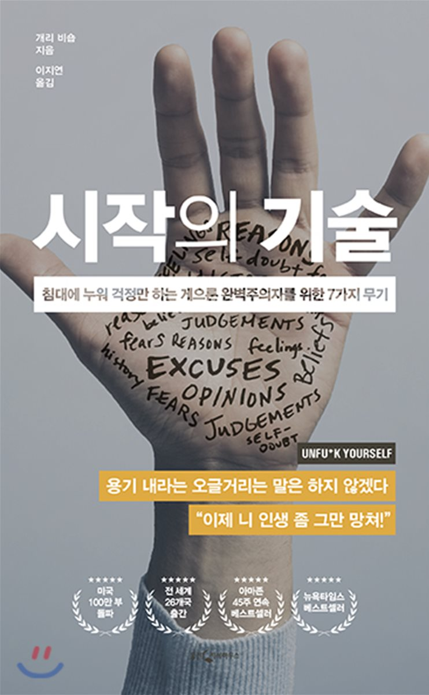

### 시작의 기술
 시작의 기술은 겉표지가 마음에 들었던 책이다. 다른 책들과 달리 양장본으로 구성돼 맨들맨들했던 촉감이 마음에 들었던 것 같다. 마치 나는 자기계발서다 라고 강조하는 이름을 갖고 있는게 매력적이긴 했다. 내용 중 ***기대*** 관련 내용과 ***진화론*** 내용이 많이 기억이 남는 것 같다. 늘 생각하는 거지만, 사람은 상황에 따라 책에 끌림이 다르다고 생각한다. 그 책에서 상황에 따라 문장의 울림도 다르다고 생각한다. 현 시점에서는 다양한 문장들 중 <mark> 기대 </mark>에 대한 관점이 많이 끌렸던 것 같다.또, 자기계발서를 읽으면서 느낀 것은 이런 부류의 책을 많이 읽으면 ***신경가소성*** 으로 인해서 자기계발에 대한 관점이 커지는 것 아닐까? 하는 생각이 들었다. 다른 이들이 주장하는 것과 같이 매번 동일한 내용을 이야기한다 라고 주장하는 것과는 다르게 이런 책들을 생각을하면서 읽으면 ***신경가소성***이라는 흐름에 의해 좀 더 개발과 성장에 초점을 맞출 수 있지 않을까? 하는 생각이 들었다.

### 책을 읽고 좋았던 점
> 인간의 감정은 대개 생각에서 나온다. 그러고 나면 인간은 당초 그 감정을 만들어냈던 생각을 다시 통제해서, 아니면 받아들였던 문장이나 자기 대화를 바꿔서, 감정을 눈에 띄게 통제한다.

> 미묘하게 부정적인 자기 대화 역시 우리의 힘을 앗아갈 수 있다. 어떤 일을 하면서 ‘아, 너무 힘드네. 제때에 못 끝내면 어떻게 하지?’라고 생각하거나, 내가 이 일을 망칠 수 있는 수백 가지 방법을 떠올린다면 마음은 불안해질 수밖에 없다. 앞서 말했듯 때로는 부정적인 자기 대화 때문에 전혀 관계없는 상황에서 엉뚱하게 분노나 슬픔, 좌절감이 치밀어 오르기도 한다.

- 위 두문장을 보고 생각을 어떻게 가지는가에 따라 내 감정이 조절되는구나를 많이 생각했다.

> 상처 느끼기를 거부하면 상처 자체가 사라진다

- 아이러니 하지만, 재밌는 관점이다 :)

> 인생이 얼마나 불공평한지 종종 토로하고 있다면 당신은 머지않아 그런 시각에 맞춰 행동하게 될 것이다. 아무도 당신을 무시하지 않았는데 무시당했다고 느끼고, 노력해봤자 아무것도 이루지 못할 테니 노력 자체를 줄일 것이다. 불공평하다는 시각이 곧 현실이 될 것이다.

- 빌게츠가 한 말이 많이 떠올랐다. "인생은 불공평하다는 것을 인지하고 살아라" 정말 맞는 말인 것 같다. 공평하다고 생각하면 막연한 기대가 생긴다. 불공평한 과정에서 최선의 대안을 찾는게 중요한 것 같다.

> 생각이 실제로 뇌의 물리적 구조를 바꿀 수 있다는 사실을 발견했다. ‘신경가소성’이라고 하는 이 현상은 인간 정신을 이해하는 데 혁명

- 이 말에 대해 정말 많이 동의한다. 황농문 교수님이 작성한 ***공부의 힘*** 이라는 도서에서도 나왔듯이 얼마나 많이 생각하느냐가 중요하다는 점이 많이 떠올랐다. 생각을 하면 하게 될 수록 신경망의 시냅스들이 연결되게 되고 그런 통로(?)가 가소성을 만드는 것이 아닐까? 생각하게 되었다.

> 부정적 경험이 그 하나로 그치는 경우가 별로 없다는 점이다. 부정적 경험은 전염된다. 마치 독성물질처럼

- <mark>깨진 유리창의 법칙</mark> 이 떠올랐던 구절이다. 어느 동네인지는 기억에 나지 않지만, 지하철에 깨진 유리창이 생겼을 경우 주변 환경자체가 더 더러워졌던 실험이 있었다. 그 유리창을 매꿨더니 자체적으로 환경이 개선되었다는 결론에 도달한 내용이다. 이와같이 부정적인 경험은 전염되는 것 같다. 이것은 인재 채용에서도 많이 쓰이는 것으로 알고있다. 스티브 잡스의 전기에서 나왔던 내용 중 하나로 A급인재는 A급 인재만 끌고 오고 만약 C급인재가 들어오는 순간 물이 C급이 되는 문제가 있다는 것을 알려주었다. 그 만큼 내가 어떤 사고를 하고 어떤 환경을 갖느냐에 따라 내 정서적 육체적 정말 많은 것이 좌우되는 구나를 알게되었다.

> 신 눈에는 보이지 않을지 몰라도 우리는 다 같은 처지다. 남의 삶은 늘 하이라이트만 보이고, 내 삶은 늘 무대 뒤가 생각난다. 지금 당신이 어디쯤 왔느냐에 따라 다르겠지만, 당신에게는 뒤돌아볼 수 있는 멋진 경험이 수십 개 혹은 수백 개는 있다. 졸업, 승진, 수상, 파티, 연애. 어린 시절 누군가 당신을 토닥이며 재워주던 기억. 익숙한 기분을 느끼며 따뜻하고 기쁜 마음이 들게 하는, 기억할 만한 맛과 풍경, 소리들 당신이 직면했던 모든 문제를 결국에는 극복했다는 사실을 기억하라. 그중 많은 기억이 지금 겪고 있는 일과 아주 비슷할지도 모른다.

- 세상을 풍요롭게 생각해 볼 수 있는 좋은 구절이 아닌가 생각했다. 내가 지금 무기력 할 수도 있다. 그 이유는 다양할 수 있다. 하지만, 무기력에서 잠시 한 발짝 물러나 내가 처음 어떤 느낌을 가지고 여기까지 오게 되었는지를 고민해보는 게 좋을 것 같다는 생각이 들었다. 연인이 되었 건, 회사 생활이 되었 건.. 첫 만남, 첫 입사를 한번 떠올려보자. 내가 이렇게 지내기 위해 그렇게 기뻐했던가? 생각해보면 좋은 관점을 가질 수 있을 것 같다는 생각을 했다.

- 오늘은 평소와는 다르게 행동해보길 바란다. 전형적으로 부정적이거나 비생산적인 당신의 사고는 접어두고 한번 행동해보길 바란다. 순간순간 눈앞의 것이 요구하는 대로 행동하라. 감정은 잊어라, 행동을 해라!

> 우리가 보지 못하는 것은 그러는 동안 숨은 기대도 차근차근 쌓아가고 있다는 점이다. 최선을 다해 만든 계획의 토대에 숨어 있는 갈라진 틈과 균열은 생각한 아이디어를 제대로 펼쳐보기도 전에 프로젝트 자체를 무산시킬 수 있다

- 우리가 무기력함을 얻던 지루함을 얻던 실망을 얻던 그것은 우리가 알지 못했던 ***기대***에서 비롯된 것 아닐까?

> 아무것도 기대하지 않으면 현재를 살게 된다. 미래를 걱정하지도 않고 과거를 부정하지도 않는다. 상황이 닥치면 닥치는 대로 그냥 환영하게 된다. 모든 것을 받아들인다는 말은 모든 게 허용된다거나 모든 것에 동의한다는 뜻이 아니다. 다만 당신이 모든 것의 주인이 되고 책임자가 된다는 뜻이다. 주인의식과 책임감을 가진다면 언제나 주어진 것을 바꿀 수 있다. 때로는 이게 당신의 문제를 해결하는 가장 효과적인 방법 그런데 기대를 놓아주는 순간, 일어나는 상황을 있는 그대로 수용하는 법을 배우는 순간, 남들과의 관계는 믿기지 않을 만큼 더 좋아진다.

- 요즘 나에게 많이 필요한 말인 것 같다. 사람에서건 일에서건 너무 많은 의존을 하게 된다면 기대가 생기는 것 같다. 사람은 불완전하기 때문에 기대가 생길 수 밖에 없는것 아닐까? 하는 생각도 들었다. 사회 생활을 처음 하는 사원에게는 모든 걸 알겠다는 기대감이 있을 것이고 사람을 만나는 동안에는 이렇게 해줬으면 하는 기대감이 생길 것이다. 그 기대를 벗어나야 좋은 관계 좋은 진급이 가능한 거 아닐까 하는 생각을 하게 해 준 좋은 구절이다.

{: width="130" height="220"){: .center}

