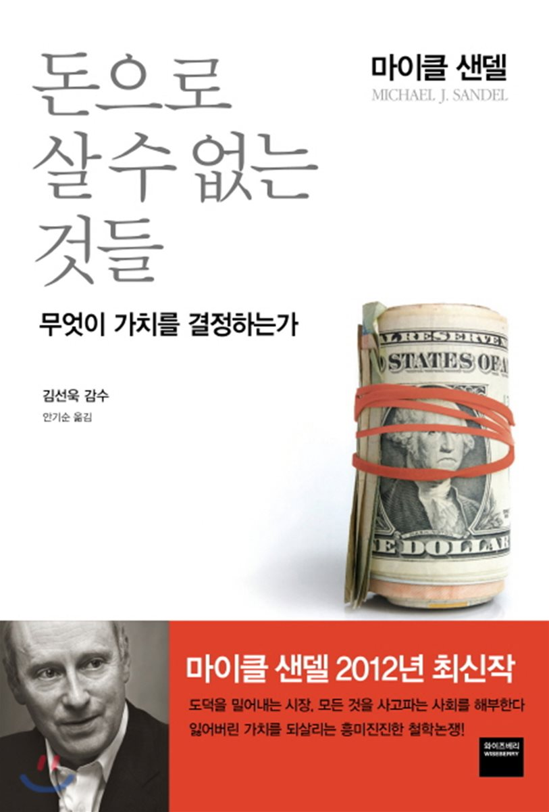

### 돈으로 살 수 없는 것들
'정의란 무엇인가' 라는 책으로 국내 명성을 산 마이클 샌델의 또 다른 저서이다. 이전 독서모임을 진행할 때, 누군가 이 책을 읽고 와서 되게 신기하다 혹은 재밌겠다 생각을 했었는데 마침 지정도서로 선정돼 이 책을 읽게 되었다. 책의 내용은 틈틈히 리뷰를 읽어서 알고 있었지만, 직접 읽어보니 재미있는 부분들도 많이 있었다. 특히, 교수님께서 책을 쓸 때 본인의 의견을 반영하기 보다는 어떤 레퍼런스들을 참조해 찬성하는 입장과 반대하는 입장을 같이 들어주면서 작성한 것 같아 좋았다. 독자로 하여금 자네는 어떤 생각을 가지고 있는가? 라고 되묻는 것 같아서 재미있었던 것 같다. 생각해보면, 자본주의 사회를 살아가는 우리는 너무 자본주의 시스템을 모르는 것 아닌가라는 생각이 많이 들었다. 물론, 본인보다 많이 알고 있는 사람들도 많겠지만 대게 교등교육까지 받은 본인이 느끼기에 대학을 위한 시험 준비 혹은 취업을 위한 시험준비를 해야하는 시스템에서 자본주의를 둘러 볼 시간이 있을까? 하는 생각이 많이 들었다. 음모론 적인 발상을 해보자면, 마치 자본주의 시스템을 잘 이해하고 어떤 이익을 내는 집단들이 영역으로 들어오는 게 싫어서 자본주의 시스템을 이해하는 방향을 제시하지 못하게 하는 것 아닐까? 하는 재미난(?) 생각도 해봤다. 우리가 어려서 배울 수 있는 도덕적 가치나 재화의 가치에서 많이 벗어나고 있는 사회에 대해 화두를 던져주는 책이며, 정말 돈으로 살 수 없는 것들이 없어지는 세상이 다가오고 있구나 하는 경각심까지 들었던 책이다. 기회가 된다면 돈으로 살 수 없는 것이 무엇인지 한 번 진지하게 생각해보고 이런 사회를 살아가는 우리가 어떤 자세로 세상에 임해야하는지 고민해보면 좋을 것 같다.

### 책을 읽고 좋았던 점
> 센델은 시장의 공정성을 통한 자원의 효율적 배분이 모두에게 이로울 것이라는 주장을 반박한다. 이 사회에는 돈으로 구매할 수 있는 것과 없는 것이 있는데, 돈으로 구매해서는 안되는 성, 입학자격, 노벨상, 환경, 사회봉사까지 돈으로 사고 팔면, 인간으로서 지켜야 할 도덕적 가치가 밀려난다고 주장한다. 즉, 시장의 교환은 중립적인 것이 아니라, 재화의 가치를 변질 시키게 된다는 말이다.

- 추천사에 적힌 내용이다. 추천사에서 이번 책에서 주장한 걸 정말 잘 요약해서 발췌해보았다.

> 무엇이 정말로 소중한 것인가? 어떻게 살아가고 싶은가? 라는 근본적인 질문에 우리는 답해야한다.

- 재화의 가치가 변질돼 자본주의 시스템에 녹아든다면, 우리가 정말로 소중한 것이 무엇인지를 정할 수 있을까? 자본 즉, 돈으로 환산 했을 경우 얼마인가로 소중한 것을 따져야하는 시대가 오는 것 아닐까? 하는 생각이 들었다.

> 세상에는 돈으로 살 수 없는 것들이 많이 있다. 그런데 요즘 많이 남지 않았다.
	- 교도소 감방 업그레이드
	- 나 홀로 운전자가 카풀차로 이용하기
	- 미국으로 이민할 권리
	- 인도 여성 대리모
	- 의사의 휴대전화 번호
	- 대기에 탄소를 배출할 권리
	- 명문대 입학 허가

- 위의 것들이 당연하게 여겨지는가? 그렇다면 자본주의의 시스템에 완벽히 적응한 것이다. 좋지않은 말로하자면, 노예가 된 것 아닐까..? 하는 생각도 든다.

> 거래만능시대. 우리가 모든 것을 사고 팔 수 있는 사회를 향해 나아가고 있다는 사실에서 걱정하는 것은 무엇인가? 바로 불평등과 부패이다. 모든 것이 거래 대상인 사회에서 생활하기란 재산이 넉넉하지 않은 사람에게는 더욱 힘들다. 따라서, 돈으로 살 수 있는 대상이 많아질수록 우리가 부유한지 가난한지가 더욱 중요해진다.

 - 스포츠카 등과 같은 단순한 재화에서만 이야기를 하자면, 불평등은 문제가 되지 않는다. 불평등은 정치적 영향력, 좋은 의학치료, 입학과 관련이 있다.

> 무엇이든 사고 파는 세상에서는 돈이 모든 차별의 근원이 되기 때문이다.

- 정말 중요한 말인 것 같다. 돈을 기준으로 세상을 바라보게 된다면, 차별적인 시야를 갖고 세상을 살아갈 것 같다. 그래서 돈이 주가 되면 안된다라는 생각을 많이한다. 좀 더 유연하게 살자 라는 생각을 갖고 살고싶다. 하지만, 자본주의 사회에서는 돈은 필요하다는 것도 동의한다. 참 어려운 문제다..

> 모든 것을 거래 대상으로 삼기를 주저해야하는 이유는 시장의 부패성향 때문이다. 삶 속에 나타나는 좋은 것에 가격을 매기는 행위는 그것을 오염시킬 수 있다. 
- 예를들어, 아이들에게 돈을 주어 책을 읽게 하는 행위는 아이들의 독서에 힘쓰게 만들지는 모르나, 독서를 내재적 만족의 원천이 아닌 일종의 노동으로 여기게 한다. 또, 대학의 입학허가를 경매에 부쳐 최고 입찰자에게 파는 행위는 대학 재정에 보탬이 될지는 모르나 대학의 품위와 대학입학의 가치를 해칠 수 있다.

> “새치기” -> ‘선착순’의 개념이 점차 희미해지고 있다. 약간의 돈만 더 내면 공항 보안 검색대든 놀이공원의 인기 놀이기구든 줄을 서서 기다릴 필요 없이 빨리 이용할 수 있기 때문이다. 지불할 수 있는 능력에 따라 재화를 분배하는 시장논리가 ‘선착순’ 이라는 전통적 관행에까지 영향을 미치고 있다.

> 공항과 놀이공원, 의회복도와 병원 대기실에서 ‘선착순’ 이라는 줄서기 윤리가 ‘돈을 낸 만큼 획득한다’는 시장윤리로 대체되고 있다. 이러한 변화는 한때, 비시장 규범이 지배했던 삶의 영역에 돈과 시장의 영향력이 커지고 있다.

- 책의 내용을 정리해보았다.

- 줄서기에 관한 옹호하는 입장
  - 개인의 자유 존중
      - 자유 지상주의자 입장. 타인의 권리를 침범하지 않는 한 원하는 재화는 무엇이든 자유롭게 사고 팔 수 있어야한다.
      - 법은 성인이 상호 동의에 따라 내린 선택을 방해함으로써 개인의 자유를 침해한다.
  - 행복이나 사회적 효과 극대화
      - 공리주의자 입장. 시장에서의 거래가 구매자와 판매자에게 똑같이 이익을 제공하고, 결과적으로 집단의 행복이나 사회적 효용을 향상시킨다.
      - 돈을 지불하는 사람과 돈을 받는 사람 사이에 거래가 성립됐다. 결과적으로 양측 다 이익을 얻었다.
      - 이런 시장 거래의 결과로 구매자와 판매자는 모두 행복해지고 효용은 증가한다.
          - 위의 말이 바로 자유시장이 재화를 효율적으로 분배한다고 주장하는 경제학자의 입장.
      - 암표판매. (맨큐)
          - 부족한 자원을 효율적으로 분배하라면, 재화는 그 가치를 가장 높게 평가하는 소비자에게 돌아가야 한다. 암표 거래가 바로 시장이 효율적 결론에 도달하는 방식을 나타내는 예다.
- 줄서기의 도덕적 측면
  - 돈을 지불 할 여력이 되지 않는 사람에게는 불공정한 행위가 된다.
      - 공리주의자 => “최고 가격을 자발적으로 지불하는 사람에게 입장권이 돌아가게 하는 것이 셰익스피어의 공연의 가치를 가장 높게 평가하는 사람을 결정하는 최고의 방법”
      - 위 주장은 설득력이 떨어진다. 우리의 목적이 사회적 효용을 극대화 하는 것이라 할지라도, 자유시장이 줄서기보다 믿음직스럽지 않을수도 있다. 어떤 재화에 기꺼이 가격을 지불하려는 것이 꼭 해당 재화의 가치를 높게 평가한다는 뜻은 아니기 때문이다. 시장 가격에는 자발적으로 지불하려는 마음만큼이나 지불할 수 있는 능력도 반영된다. 그리고 어떤 경우에는 최고 가격을 내고 입장권을 손에 넣은 사람이라도 그 경험의 가치를 전혀 높게 평가하지 않을 수도 있다.
          - 예를들어, 야구장에 늦게 도착해 비싼 관람석에 앉아있다가 일찍 자리를 뜨는 사람들을 볼 수 있다. 이런 경우, 그들이 야구를 얼마나 좋아하는지 의심스럽고, 경제적 능력은 경기를 향한 열정보다 주머니 사정과 관계가 깊을 수 있다.
          - 자리와 상관없이 타율을 깨고 있는 사람들도 존재한다.
          - 이런걸 보면, 특정 재화의 가치를 가장 높게 평가하는 사람인지 가려내는 방법은 불완전하다.

> 마약 중독 여성이 불임시술을 받고 인센티브를 받는것이 대해 어떻게 생각하는가?

- 이것 또한 재미있는 주제이다.

- 반대하는 입장
  - 돈이 절실하게 필요한 마약중독자들에게 인센티브가 제공된다면, 순수하게 자발적인 선택을 할 수 없다.
  - 불임시술에 현금을 보상하는 제안 -> 강압, 뇌물
    - 첫 번째 문장과 동일 -> 총을 겨눈건 아니지만, 매혹적인 대가를 가지고 선택을 유도하는 건 강압
    - 뇌물이 불미스러운 이유는 강압이 아닌 부패한 행위이다. -> 팔아서 수익을 얻을 목적으로 아이를 임신하는 행위는 부모의 역할이 부패한 것.
- 찬성하는 입장
  - 그들의 판단력이 그만큼 흐려졌다면, 임신과 자녀양육에 대해 어떻게 분별있는 결정을 할 수 있을것인가.

> 인센티브는 뇌물의 혐의가 적절하다. 아무리 좋은 의도로 했다고 하더라도.. 예를들어, 금연 장려금.  

- 금전상의 동기가 더욱 바람직한 다른 동기를 밀어낸다는 의심이 들기 때문이다. 건강에 좋은 자세는 콜레스테롤 수치와 체질량지수를 적절한 수준으로 유지하는 것에 국한되지 않고 자신의 신체적 행복에 대해 올바른 태도를 개발하고 자기 신체를 돌보고 존중하는 것이다. 하지만, 약을 복용하도록 사람들에게 돈을 지급하는 행위는 이러한 행동을 키울 수 없고 오히려 해칠 수도 있다.

- 뇌물이 사람들 교묘하게 조종하기 때문이다. 
  - 성적이 좋은 아이들에게 돈을 주면 공부를 잘하게 하려는 본래의 의도는 사라지고 아이들은 돈을 받기 위해 공부할 것이다. 시장적 인센티브가 비시장적 인센티브를 밀어내기 때문이다. 

{: width="130" height="220"}{: .center}

