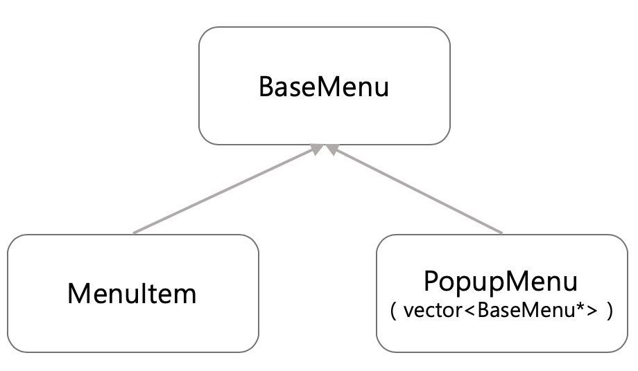

### Intro
- Composite pattern에 대해 알아보고 menu system을 만들어 보자.

#### Menu system
- 아래의 그림과 같이, GUI 시스템으로 구성된 메뉴가 있다고 가정하자.


- 메뉴 시스템을 만들때 구성해야할 것들을 고려해보자.
  - 우리는 GUI 프로그램이 아닌 C++로 구성해야되기 때문에, 콘솔 화면로 GUI를 구성하는 뼈대를 만들 것이다.
    - MenuItem : 메뉴를 담는 객체
    - PopupMenu : 하위 항목을 담는 객체 (e.g. 최근 사용항목)
  
  - PopupMenu 같은 경우, MenuItem들을 담고 있다. 그렇다면, 우리는 ***vector<MenuItem*>*** 을 이용해서, list화 시켜도 될까?
    - 위와 같은 방식으로 list화 시키게 될 경우 문제가 된다. 왜냐하면, 하위 항목 내 하위 항목이 존재 할 수도 있다.
    - 위와 같이 하위항목 내 하위 항목으로 묶어서 관리하기 위해서는 upstream 방식을 이용해야한다. 즉, 공통된 것들을 기반클래스로 묶어서 관리해야한다.



- 객체지향 모델을 디자인 할경우, 몇 가지 생각해야하는 핵심 중에 가장 중요한 것은 <mark> 공통적인 것은 묶어라</mark> 와 <mark> 변하는 것과 변하지 낳는 것을 분리해라 </mark> 이다. 다른 핵심들도 여러가지가 존재하지만, 이 두가지가 정말 큰 부분을 차지 한다.

#### MenuItem 만들기

```c
#include <iostream>
#include <string>
#include <vector>

using namespace std;

class BaseMenu
{
  string title; // title 같은 경우, menu에서 다 가지는 케이스다.
public:
  BaseMenu(string s) : title(s) {}
  string getTitle() const { return title; }
  
  virtual void command() = 0; // 정말 중요한 핵심 기술중에 하나이다.
};

class MenuItem : public BaseMenu
{
  int id;
public:
  MenuItem(string s, int n) : BaseMenu(s), id(n){}
  virtual command() override
  {
    cout << "getTitle()" << endl;
  }
};


int main()
{
  MenuItem m("sound",11);
}
```

- MenuItem을 구현할 경우, MenuItem(int n) 이라고 생성자를 정의할 경우 생각해보자. 흔히들 하는 실수이다.
  - 위와 같이 인자 하나받는 생성자의 경우 MenuItem 객체를 생성할 경우 Menu(11)을 넣을 수 있다. MenuItem class 같은 경우 파생클래스 임으로, 기반 클래스를 호출한다. 기반 클래스에서 default 생성자 즉, 인자가 없는 생성자가 없을 경우 에러가 발생한다. 이를 막기 위해서는 <mark>BaseMenu(s)</mark> 위의 코드와 같이, string을 전달해 기반 생성자를 만들어야한다.

#### PopupMenu 구현
- PopupMenu 같은 경우, MenuItem list를 보여주는 일을한다. 하지만, 핵심은 하위 항목들을 다시 보여주는 즉, ***재귀적 흐름*** 이 존재한다는 점이다.
