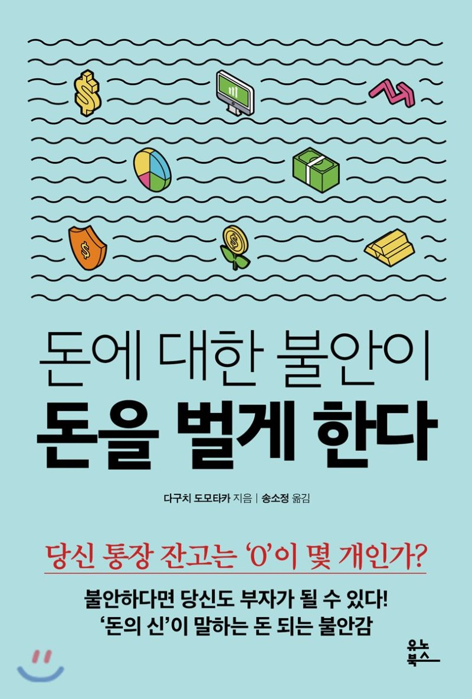

### 돈에 대한 불안이 돈을 벌게 한다

### 책을 읽고 좋았던 점
> 세상에는 두 부류가 있다. 돈 때문에 고생하는 사람과 고생하지 않는 사람. 늘 돈 문제에 스트레스만 받으면서 아무것도 하지 않는 사람이 있는 한편, 돈에 대한 불안감을 최대치로 올려 정말 확실하게 돈을 버는 사람

- 돈에 대한 관점을 바꿔보자.

> 우리 어른들은, 돈은 당연히 피땀 흘려 벌어야 하지만 그렇게 큰돈을 벌어도 좋을 게 없다고 말했다. 고도 경제 성장기에 자란 사람들이 금전 교육을 그렇게 받았기 때문이다. 회사에 순종하는 직원은 경영자 입장에서 무척 편한 존재였다. 그래서 나라와 기업 수장들은 노동자에게 ‘돈, 돈, 돈’ 하는 것이 천박하다고 주입되어 왔다.

- 고성장 시대였을 때 사고와 저성장 시대에 사고는 다르다는 걸 인정할 필요가 있다. 고성장시대 정년이 보장되고 취업이 보장되는 시기에서 돈에 대한 걱정은 크지 않았을 것 같다. 하지만, 저성장 시대의 청년들에게는 모든게 짐으로 다가오고 힘들어진다는 점을 기억할 필요가 있다.

> 올바른 투자 지식을 배울 기회가 없기 때문이다. 유럽과 미국에서는 국민들에게 사회에 진출해 돈 벌 때를 대비시킨다. 그 일환으로 자산을 제대로 운용해 어려움을 겪지 않도록 학교에서 투자 교육을 한다. 그런데 우리는 그런 교육을 받아 보지 못했다. 그래서인지 투자에 거부감을 가지는 사람이 많다

- 돈으로 살 수 없는 것들에서 느꼈던 내용이 나와서 좋았다.

> 미래가 불확실한 시대에서 더더욱 필요한 능력은 단연코 ‘돈 버는 힘’이다. 당신에게 이 힘만 있다면 어떤 일이 생겨도 괜찮다. 금융이 파탄 나도, 사업에 실패해도, 회사가 도산해도, 돈 버는 능력만 있으면 두려울 것이 없다

- 돈을 엄청 많이 버는 것 보다 중요한 점이 있다.
  - 막대한 수입 < 돈버는 힘

> 보통 직장인들이 이렇다. 매일 야근한다. 늦은 밤에 하는 저녁 식사는 간단히 편의점 도시락으로 때운다. 책상에는 ‘당신의 연봉을 10배 올리는 방법’ 같은 자기계발서가 놓여 있지만, 집에 가면 그 책을 읽을 만한 체력은 남아 있지 않다. 휴일에는 평소 쌓인 피로를 풀기 위해 늦은 오후까지 이불 안에서 빈둥빈둥한다. 장래는 불안하지만 성실하게 일하면 좋은 날도 올 거라고 막연히 기대한다.

- 자기 계발 내용인 것 같지만 요즘 많이 생각하는 문구라 적어본다.

> 대책 없이 긍정적이기만 한 사람이 의외로 많다. 부자가 되지 못하는 사람의 전형적인 사고방식이다. ‘지금은 돈이 없지만, 돈은 돌고 돌아 나중에 다 생기는 법이야.’ 지금 아무 노력도 안 하면 나이를 한 살 한 살 먹을 때마다 생활은 더욱 힘들어진다고 생각해야 한다. 이런 시대에 태어나서 어쩔 수 없다고 단단히 각오하는 수밖에 없다.

- 긍정적인 시각을 가진 건 좋지만, 늘 양날의 검인 것을 기억할 필요가 있다.

> 당신은 한 달에 얼마를 벌고, 얼마나 소비하는지 정확히 파악하고 있는가? 현금 흐름을 영어 그대로 ‘캐시 플로우’라고 한다. 캐시 플로우를 훤하게 아는 것은 부자가 되기 위한 기본 중의 기본이다. 수입, 지출, 자산에서 돈이 어떻게 움직이는지 파악하지 못하면 부자는 절대 될 수 없다.

- 캐시 플로우라는 건 경제에 대한 메타인지가 높다는 거 아닐까? 무튼 좋은 말인 것 같다.

> 돈을 어느 정도 모을 때까지는 우선 전력을 다해 액셀러레이터를 밟아 질주하라. 비행기도 이륙 시에 엔진을 빨리 돌린다. 그렇게 해야 비행기가 날아오른다. 안정된 비행을 하려면 단번에 상승해야 한다. 이상을 좇는 것은 돈을 벌고 나서도 늦지 않다.

- 자신이 어느 시기인지 파악하는게 중요한 것 같다. 즉, 메타인지가 높아야 한다.

> 밥을 천천히 먹으면 포만중추가 정상적으로 작동해 소량을 섭취해도 포만감을 느낄 수 있다.

- 요즘 많이 느끼고 있는 것이다. 다이어트도 다이어트지만, 업무 혹은 공부를 할 경우에 많이 먹으면 집중이 되지 않는다. 더부룩함이 동반되기 때문에 늘 밥을 먹을 때 경계하는 것이 좋을 것 같다.

> 불언실행不言實行’은 말을 앞세우기보다 행동으로 보여 준다는 뜻이다. 그런데 최근에는 자기가 한 말을 반드시 실행한다는 ‘유언실행有言實行’이 인기

- 경험을 해보면 알 수 있는 말이다. 본인은 불언 실행이 맞다고 생각한다. 이 말도 개인 성향에 따라 적용되는 게 있을 것이라 생각한다. 누군가는 여러사람에게 알림으로서 힘을 얻고, 누군가는 말하지 않고 그 일을 활용해 동기부여를 지속하는 경우도 있다.

> 밤늦게까지 회사에 남아서 일하는 사람은, 일을 못 하는 사람이다. 곧 돈을 못 버는 사람이다. 단 30분이라도 좋으니 아침에 일찍 나와 쾌적한 업무 환경을 느껴 보기를 바란다. 이것이 돈 버는 능력을 높이고 나아가 돈 문제에서 자유로워지는 방법

- 이건 상당히 조심해야하는 발언인 것 같다. 아침형 인간은 좋은 걸 인정한다. 직업에 따라 다르다고 언급하지만, 이렇게 단정지어 책에 적는 건 좋지않다고 생각한다.

{: width="130" height="220"}{: .center}
