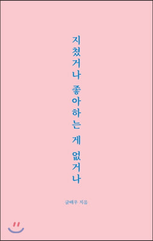

### 지쳤거나 좋아하는 게 없거나

### 책을 읽고 좋았던 점

> 누가 시키는 일, 해야 될 일에
> 급급히 하루를 보내고 잠드는 게 아니라 
> 앞으로 살아갈 방향에 대해
> 많은 생각을 깊게 할 수 있었다.
> 말하고 싶은 건
> 내가 노력해서 얻는 것이 아니라고 하면
> 내 삶은 진짜 성장한 게 아닐지 모른다.
> 아직 기대고 살고 있는 것이기에 마음은 불안하다.
> 기대기만 하는 사람은 문제가 생겼을 때
> 스스로 해낼 수 있는 능력을 스스로 모르기에 불안하다.
> 스스로 성장 할 수 있는 기회를 잃은 채 살아간다.

- 본인생각

{: width="130" height="220"}{: .center}
